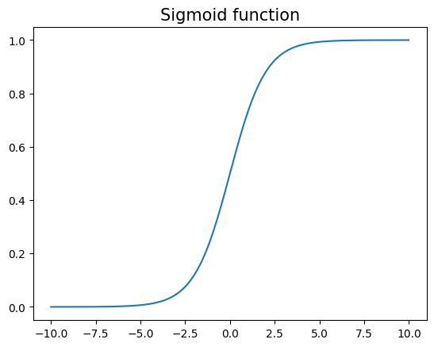
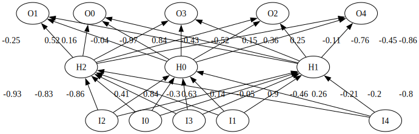
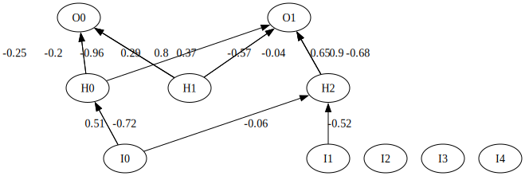
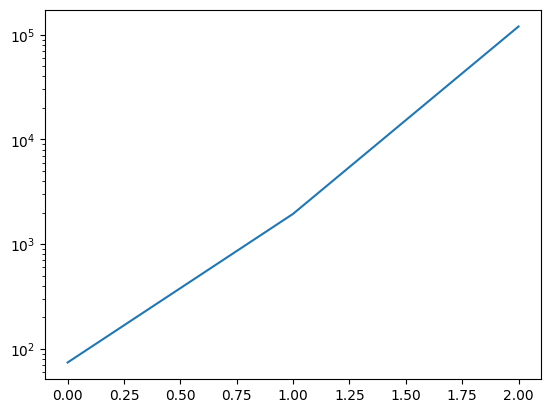
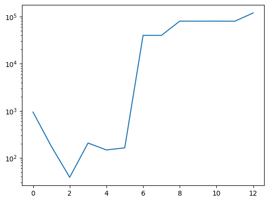

# Neuroevolution

Neuroevolution uses evolutionary algorithms to optimise neural networks. Before we start with the implementation of neural networks, let's import required dependencies.


```python
import random
import math
from statistics import mean
import numpy as np
import matplotlib.pyplot as plt

from graphviz import Digraph
```

## Neural Networks

Neural networks consist of neurons and weighted connections between these neurons. Each neuron represents a processing unit in which an activation function is applied to the weighted sum of all incoming connections. After a neuron has been activated, its activation signal is further propagated into the network.


```python
# Basic neuron definition from which all neuron genes will be derived.
class Neuron:

    def __init__(self, uid: str):
        self.uid = uid
        self.signal_value = 0
        self.activation_value = 0
        self.incoming_connections = []
```

### Input Neuron

Input neurons receive a signal from the environment (input feature) and propagate it into the network. Since we are interested in the raw input signal, we refrain from applying any activation functions within the input layer.


```python
class InputNeuron(Neuron):

    def __init__(self, uid: str):
        super().__init__(uid)

    def activate(self) -> float:
        self.activation_value = self.signal_value
        return self.activation_value
```

### Hidden Neuron

Hidden neurons reside between input and output neurons. They increase the capacity of a neural network, in other words, we require more hidden neurons for complex tasks than for simple ones. The number and distribution of neurons is an optimisation task on its own and one of the main reasons to use neuroevolution. As an activation function, we will use the sigmoid function, which maps any input value to $[0,1]$.


```python
def sigmoid(x: float):
    return 1 / (1 + math.exp(-x))

x_range = np.arange(-10, 10, 0.01)
sigmoid_values = [sigmoid(x) for x in x_range]
plt.plot(x_range, sigmoid_values)
plt.title('Sigmoid function', fontsize=15)
plt.show()
```


    

    


```python
class HiddenNeuron(Neuron):

    def __init__(self, uid: str):
        super().__init__(uid)

    def activate(self) -> float:
        self.activation_value = sigmoid(self.signal_value)
        return self.activation_value
```

### Output Neuron

For our output neurons, we have to choose an appropriate activation function that matches the given task. Later, we will try to solve a binary decision problem in which a robot can move to the right or left. Hence, we could use a sigmoid function, whose output is treated as a probability for choosing one of the two classes. However, due to the neuroevolution algorithm we will implement, we add two output neurons to the output layer, assign one output neuron to each class, and choose the class whose output neuron has the highest activation value.


```python
class OutputNeuron(Neuron):

    def __init__(self, uid: str):
        super().__init__(uid)
        self.uid = uid

    def activate(self) -> float:
        self.activation_value = self.signal_value
        return self.activation_value
```

### Connections

Our neurons are rather useless as long as they are not connected. We define connections by their source and destination neurons. Furthermore, we assign a weight to each connection to specify the strength of a link between two neurons.


```python
class Connection:

    def __init__(self, source: Neuron, target: Neuron, weight: float):
        self.source = source
        self.target = target
        self.weight = weight
```

### Network Definition

With our neurons and connections defined, we can now assemble both components in layers to build a neural network.


```python
class Network:
    def __init__(self, layers: dict[float, list[Neuron]], connections: list[Connection]):
        self.layers = layers
        self.connections = connections
        self.generate()

    # Traverse list of connections and add incoming connections to neurons.
    def generate(self):
        for connection in self.connections:
            connection.target.incoming_connections.append(connection)
```

Let's build a network with five input neurons, three hidden neurons and two output neurons.


```python
def gen_simple_network() -> Network:
    input_neurons = [InputNeuron(f"I{x}") for x in range(5)]
    hidden_neurons = [HiddenNeuron(f"H{x}") for x in range(3)]
    output_neurons = [OutputNeuron(f"O{x}") for x in range(5)]

    # Assemble in layers with 0 representing the input layer and 1 the output layer.
    layers = {0: input_neurons, 0.5: hidden_neurons, 1: output_neurons}

    # Generate connections from every input neuron to each hidden neuron
    connections = []
    for input_neuron in input_neurons:
        for hidden_neuron in hidden_neurons:
            weight = random.uniform(-1, 1)
            connections.append(Connection(input_neuron, hidden_neuron, weight))

    # Generate connections from every hidden neuron to each output neuron
    for hidden_neuron in hidden_neurons:
        for output_neuron in output_neurons:
            weight = random.uniform(-1, 1)
            connections.append(Connection(hidden_neuron, output_neuron, weight))

    return Network(layers, connections)


net = gen_simple_network()
```

We can visualise our generated network using the Graphviz library.


```python
class Network(Network):
    def show(self) -> Digraph:
        dot = Digraph(graph_attr={'rankdir': 'BT', 'splines': "line"})
        # Use sub graphs to position input neurons are at the bottom and output neurons at the top.
        input_graph = Digraph(graph_attr={'rank': 'min', 'splines': "line"})
        output_graph = Digraph(graph_attr={'rank': 'max', 'splines': "line"})
        hidden_graph = Digraph(graph_attr={'splines': "line"})

        # Traverse network from input to output layer and assign neurons to corresponding subgraph.
        layer_keys = list(self.layers.keys())
        layer_keys.sort()
        for layer in layer_keys:
            for neuron in self.layers.get(layer):
                if layer == 0:
                    input_graph.node(neuron.uid, color='black', fillcolor='white', style='filled')
                elif layer == 1:
                    output_graph.node(neuron.uid, color='black', fillcolor='white', style='filled')
                else:
                    hidden_graph.node(neuron.uid, color='black', fillcolor='white', style='filled')

        # Combine the sub graphs to a single graph
        dot.subgraph(input_graph)
        dot.subgraph(hidden_graph)
        dot.subgraph(output_graph)
        # Link the nodes based on the connection gene.
        for connection in self.connections:
            dot.edge(connection.source.uid, connection.target.uid,
                     label=str(round(connection.weight, 2)), style='solid')
        return dot
```


```python
gen_simple_network().show()
```


    

    


Now that we have our network structure in place, we can implement the network activation that takes an input signal as an argument and outputs the result of the network after it has been activated. We can realise a network's activation by computing our neurons' activation values sequentially from the input to the output layer.


```python
class Network(Network):
    def activate(self, inputs: list[float]) -> list[float]:
        # Reset neuron values from previous executions
        for neuron_layer in self.layers.values():
            for neuron in neuron_layer:
                neuron.signal_value = 0

        # Load input features into input neurons
        input_neurons = self.layers.get(0)
        for i in range(len(inputs)):
            input_neurons[i].signal_value = inputs[i]
            input_neurons[i].activate()

        # Traverse the neurons of our network sequentially starting from the hidden layer.
        layer_keys = list(self.layers.keys())
        layer_keys.sort()
        for layer in layer_keys:
            for neuron in self.layers.get(layer):
                if layer > 0:
                    # Calculate weighted sum of incoming connections
                    for connection in neuron.incoming_connections:
                        neuron.signal_value += connection.source.activation_value * connection.weight
                neuron.activate()

        output_neurons = self.layers.get(1)
        return [o.activation_value for o in output_neurons]
```


```python
gen_simple_network().activate([0, 1])
```


    [0.6625307809022903,
     0.45368828054521554,
     0.0846118998733022,
     -0.580157825705678,
     -0.8643989373970461]


## Inverted Pendulum Problem

We will use our networks to solve the inverted pendulum (= pole-balancing) problem, a well-known benchmark task in the reinforcement learning community. In this problem scenario, a pole is centred on a cart that can be moved to the right and left. Obviously, any movement to the cart also impacts the pole. The task is to move the cart to the left and right such that the pole remains balanced. Whenever the cart position exceeds the boundaries of the track or the pole tips over 12 degrees, the balancing attempt is deemed a failure.

We can simulate the cart and pole system using the following two equations that describe the acceleration of the pole $\ddot{\theta_t}$ and the cart $\ddot{p_t}$ at a given point in time $t$:

$$
\ddot{p}_t = \frac{F_t + m_pl(\dot{\theta^2_t} sin\theta_t - \ddot{\theta_t} \; cos\theta_t)}{m} \; \; \; \; \; \; \; \; (1) \\
\ddot{\theta}_t = \frac{mg \; sin\theta_t - cos\theta_t(F_t + m_pl\dot{\theta}^2_t \; sin\theta_t)}{\frac{4}{3}ml - m_pl \; cos^2(\theta_t)} \; \; \; \; \; \; \; \; (2)
$$


where
- $p$: Position of the cart
- $\dot{p}$: Velocity of the cart
- $\ddot{p}$: Acceleration of the cart
- $\theta$: Angle of the pole
- $\dot{\theta}$: Angular velocity of the pole
- $\ddot{\theta}$: Angular acceleration of the pole
- $l$: Length of the pole
- $m_p$: Mass of the pole
- $m$: Mass of the pole and cart
- $F$: Force applied to the cart
- $g$: Gravity acceleration

In our simulation, we will update both systems using the discrete-time equations

$$
p(t+1) = p(t) + r \dot{p}(t) \; (3) \\
\theta(t+1) = \theta(t) + r \dot{\theta}(t) \;(4) \\
\dot{p}(t+1) = \dot{p}(t) + r \ddot{p}(t) \; (5) \\
\dot{\theta}(t+1) = \dot{\theta}(t) + r \ddot{\theta}(t) \; (6)
$$

with the discrete time step $r$ set to 0.02 seconds.


```python
GRAVITY = 9.8  # m/s^2
MASS_CART = 1.0  # kg
MASS_POLE = 0.1  # kg
TOTAL_MASS = (MASS_CART + MASS_POLE)  # kg
POLE_LENGTH = 0.5  # m
POLEMASS_LENGTH = (MASS_POLE * POLE_LENGTH)
FORCE = 10  # N
STEP_SIZE = 0.02  # sec
FOURTHIRDS = 1.333333


def cart_pole_step(action: int, p: float, p_vel: float, theta: float, theta_vel: float) -> (float, float, float, float):
    force_dir = FORCE if action > 0 else -FORCE

    cos_theta = math.cos(theta)
    sin_theta = math.sin(theta)

    temp = (force_dir + POLEMASS_LENGTH * theta_vel * theta_vel * sin_theta) / TOTAL_MASS

    # Equation 2
    theta_acc = (GRAVITY * sin_theta - cos_theta * temp) / (
                POLE_LENGTH * (FOURTHIRDS - MASS_POLE * cos_theta * cos_theta / TOTAL_MASS))
    # Equation 1
    p_acc = temp - POLEMASS_LENGTH * theta_acc * cos_theta / TOTAL_MASS

    # Compute new states
    p = p + STEP_SIZE * p_vel  # Equation 3
    theta = theta + STEP_SIZE * theta_vel  # Equation 4
    p_vel = p_vel + STEP_SIZE * p_acc  # Equation 5
    theta_vel = theta_vel + STEP_SIZE * theta_acc  # Equation 6

    return p, p_vel, theta, theta_vel
```

Let's test our cart pole system by executing a few steps starting from a clean state where all state variables are set to zero. Given a balanced pole ($\theta = 0$), we expect the pole to always move in the opposite direction of the applied force. Moreover, we expect increasing velocity values as long as we apply a force in the same direction and a decrease in velocity as soon as the force direction changes.


```python
p = 0
p_vel = 0
theta = 0
theta_vel = 0
# Move the cart for 10 steps to the right.
for i in range(10):
    [p, p_vel, theta, theta_vel] = cart_pole_step(1, p, p_vel, theta, theta_vel)
    print(f"Iteration right: {i}\nCart Pos: {p}\nCart Vel: {p_vel}\nPole Angle: {theta}\nPole AVel: {theta_vel}")
    print("--------------------")
          
# Move the cart for 15 steps to the left.
for i in range(15):
    [p, p_vel, theta, theta_vel] = cart_pole_step(-1, p, p_vel, theta, theta_vel)
    print(f"Iteration left: {i}\nCart Pos: {p}\nCart Vel: {p_vel}\nPole Angle: {theta}\nPole AVel: {theta_vel}")
    print("--------------------")
```

    Iteration right: 0
    Cart Pos: 0.0
    Cart Vel: 0.1951219547888171
    Pole Angle: 0.0
    Pole AVel: -0.29268300535397695
    --------------------
    Iteration right: 1
    Cart Pos: 0.0039024390957763423
    Cart Vel: 0.3902439095776342
    Pole Angle: -0.005853660107079539
    Pole AVel: -0.5853660107079539
    --------------------
    Iteration right: 2
    Cart Pos: 0.011707317287329027
    Cart Vel: 0.5854473662672043
    Pole Angle: -0.017560980321238616
    Pole AVel: -0.8798872190960108
    --------------------
    Iteration right: 3
    Cart Pos: 0.023416264612673113
    Cart Vel: 0.7808034482987078
    Pole Angle: -0.03515872470315883
    Pole AVel: -1.178038896588744
    --------------------
    Iteration right: 4
    Cart Pos: 0.03903233357864727
    Cart Vel: 0.9763639418404654
    Pole Angle: -0.05871950263493371
    Pole AVel: -1.4815329625443723
    --------------------
    Iteration right: 5
    Cart Pos: 0.05855961241545658
    Cart Vel: 1.172151077414685
    Pole Angle: -0.08835016188582115
    Pole AVel: -1.7919612011435535
    --------------------
    Iteration right: 6
    Cart Pos: 0.08200263396375028
    Cart Vel: 1.3681454441981398
    Pole Angle: -0.12418938590869222
    Pole AVel: -2.1107473332066196
    --------------------
    Iteration right: 7
    Cart Pos: 0.10936554284771308
    Cart Vel: 1.5642715914153589
    Pole Angle: -0.1664043325728246
    Pole AVel: -2.4390888082002777
    --------------------
    Iteration right: 8
    Cart Pos: 0.14065097467602025
    Cart Vel: 1.76038115934149
    Pole Angle: -0.21518610873683017
    Pole AVel: -2.7778872734265025
    --------------------
    Iteration right: 9
    Cart Pos: 0.17585859786285005
    Cart Vel: 1.956233861883977
    Pole Angle: -0.27074385420536023
    Pole AVel: -3.127668490894963
    --------------------
    Iteration left: 0
    Cart Pos: 0.21498327510052959
    Cart Vel: 1.7632652933902342
    Pole Angle: -0.3332972240232595
    Pole AVel: -2.9273895035470296
    --------------------
    Iteration left: 1
    Cart Pos: 0.25024858096833424
    Cart Vel: 1.571344914406432
    Pole Angle: -0.3918450140942001
    Pole AVel: -2.7515365246297137
    --------------------
    Iteration left: 2
    Cart Pos: 0.28167547925646286
    Cart Vel: 1.3805005689274916
    Pole Angle: -0.44687574458679435
    Pole AVel: -2.5992441491311347
    --------------------
    Iteration left: 3
    Cart Pos: 0.3092854906350127
    Cart Vel: 1.1907126899876923
    Pole Angle: -0.49886062756941707
    Pole AVel: -2.469569739043521
    --------------------
    Iteration left: 4
    Cart Pos: 0.33309974443476653
    Cart Vel: 1.0019309505127758
    Pole Angle: -0.5482520223502875
    Pole AVel: -2.3615648963925833
    --------------------
    Iteration left: 5
    Cart Pos: 0.35313836344502203
    Cart Vel: 0.8140860856326241
    Pole Angle: -0.5954833202781391
    Pole AVel: -2.274325969546335
    --------------------
    Iteration left: 6
    Cart Pos: 0.3694200851576745
    Cart Vel: 0.6270978571284449
    Pole Angle: -0.6409698396690658
    Pole AVel: -2.2070281641767515
    --------------------
    Iteration left: 7
    Cart Pos: 0.3819620423002434
    Cart Vel: 0.44088004947248216
    Pole Angle: -0.6851104029526008
    Pole AVel: -2.1589473496805938
    --------------------
    Iteration left: 8
    Cart Pos: 0.39077964328969306
    Cart Vel: 0.2553432345191425
    Pole Angle: -0.7282893499462127
    Pole AVel: -2.1294729185112797
    --------------------
    Iteration left: 9
    Cart Pos: 0.3958865079800759
    Cart Vel: 0.07039587671876138
    Pole Angle: -0.7708788083164384
    Pole AVel: -2.1181143011627457
    --------------------
    Iteration left: 10
    Cart Pos: 0.39729442551445115
    Cart Vel: -0.11405579905980248
    Pole Angle: -0.8132410943396933
    Pole AVel: -2.1245030706087547
    --------------------
    Iteration left: 11
    Cart Pos: 0.3950133095332551
    Cart Vel: -0.29810887869795544
    Pole Angle: -0.8557311557518683
    Pole AVel: -2.1483920226503734
    --------------------
    Iteration left: 12
    Cart Pos: 0.38905113195929597
    Cart Vel: -0.4818655664058769
    Pole Angle: -0.8986989962048758
    Pole AVel: -2.189652192573561
    --------------------
    Iteration left: 13
    Cart Pos: 0.37941382063117846
    Cart Vel: -0.6654355960582027
    Pole Angle: -0.942492040056347
    Pole AVel: -2.2482684480876864
    --------------------
    Iteration left: 14
    Cart Pos: 0.3661051087100144
    Cart Vel: -0.8489391605252926
    Pole Angle: -0.9874574090181008
    Pole AVel: -2.324334063461633
    --------------------


We can formulate our pole-balancing task as a reinforcement learning problem by implementing a simulation in which an agent's goal is to balance the pole for as long as possible. In our scenario, our agents are neural networks that decide in which direction the cart should be moved at a given state $[p, \theta, \dot{p}, \dot{\theta}]$. Since we have four input features, the networks will have four input neurons. Furthermore, these input features will be normalised over the following ranges:

$$
p: [-2.4, 2.4] \\
\dot{p}: [-1.5, 1.5] \\
\theta: [-12, 12] \\
\dot{\theta}: [-60, 60] \\
$$

We model the pole-balancing problem as a binary classification task using two output neurons, each representing one action. An action is chosen by selecting the action that belongs to the neuron with the highest activation value. Once the pole tips over 12 degrees or the 4.8 meter track is left by the cart, the trial ends. Finally, an agent's performance is measured by the number of steps it managed to survive. A balancing attempt is deemed successful whenever an agent balances the pole for 120,000 time steps, which is equivalent to 40 minutes in real time.

For a more challenging second scenario, we add an option that randomises the starting positions of the four input states.


```python
MAX_STEPS = 120000
TWELVE_DEGREES = 0.2094395  #conversion to rad (12*pi)/180

def evaluate_agent(network: Network, random_start=False) -> int:
    # Define starting state
    if random_start:
        p = random.uniform(-2.4, 2.4)  # -2.4 < p < 2.4
        p_vel = random.uniform(-1.5, 1.5)  # -1.5 < p_acc < 1.5
        theta = random.uniform(-TWELVE_DEGREES, TWELVE_DEGREES)  # -12 < theta < 12
        theta_vel = random.uniform(-1, 1)  # -60 < theta_acc < 60 (in rad)
    else:
        p, p_vel, theta, theta_vel = 0.0, 0.0, 0.0, 0.0

    # Simulation loop
    steps = 0
    while steps < MAX_STEPS:
        # Normalise inputs
        inputs = [None] * 5
        inputs[0] = (p + 2.4) / 4.8
        inputs[1] = (p_vel + 1.5) / 3
        inputs[2] = (theta + TWELVE_DEGREES) / (2 * TWELVE_DEGREES)
        inputs[3] = (theta_vel + 1.0) / 2.0
        inputs[4] = 0.5

        # Activate the network and interpret the output, and advance the state.
        net_output = network.activate(inputs)
        action = -1 if net_output[0] > net_output[1] else 1
        p, p_vel, theta, theta_vel = cart_pole_step(action, p, p_vel, theta, theta_vel)

        # Check if the attempt is still valid
        if p < -2.4 or p > 2.4 or theta < -TWELVE_DEGREES or theta > TWELVE_DEGREES:
            return steps

        steps += 1

    # At this point the agent survived for the maximum number of steps
    return steps
```

Let's create a sample network and test it in the pole-balancing environment.


```python
net = gen_simple_network()
evaluate_agent(net, random_start=False)
```


    8


As expected, our randomly generated networks could perform better. Therefore, we will now implement a Neuroevolution algorithm to optimise our networks and solve the pole-balancing task.

## SANE (Symbiotic Adaptive Neuro-Evolution)

[SANE](https://link.springer.com/article/10.1023/A:1018004120707) implements a symbiotic evolution approach, which means that it does not evolve complete solutions but parts thereof. In the case of SANE, we maintain a population of hidden neurons, which are then combined to form a neural network based on a pre-defined input and output layer. Symbiotic approaches aim to avoid premature convergence by enforcing diverse populations and specialisation of individuals in specific subtasks within the problem environment. Each individual receives a fitness score based on the average fitness of the networks in which they participated.

### Genetic Representation

Each neuron is defined by a label and weight list. The former defines the neuron from/to which the connection is coming/going, and the latter the corresponding link weight. We follow the original SANE implementation of Moriarty and Mikkulainen and define an upper bound of 254 for our label values. We connect from the input layer to the hidden neuron if the label value is smaller than 127, and otherwise, from the hidden neuron to the output layer. Moreover, we apply modulo calculus over the total number of input/output neurons to decide to which specific input/output neuron a connection is created.


```python
LABEL_BOUND = 254


class HiddenNeuronGene:
    hidden_neuron_counter = 0

    def __init__(self, labels: list[int], weights: list[float]):
        self.labels = [l % LABEL_BOUND for l in labels]  # Enforce upper label boundary.
        self.weights = weights
        self.fitness = 0
        self.evaluations = 0
        self.hidden_neuron = HiddenNeuron("H" + str(HiddenNeuronGene.hidden_neuron_counter))
        HiddenNeuronGene.hidden_neuron_counter += 1

    def generate_connections(self, input_neurons: list[Neuron], output_neurons: list[Neuron]) -> list[Connection]:
        connections = []
        for label, weight in zip(self.labels, self.weights):

            # Generate connection to input layer
            if label < 127:
                neuron_id = "I" + str(label % len(input_neurons))
                in_neuron = next((i for i in input_neurons if i.uid == neuron_id), None)
                connections.append(Connection(in_neuron, self.hidden_neuron, weight))

            # Generate connection to output layer
            else:
                neuron_id = "O" + str(label % len(output_neurons))
                out_neuron = next((o for o in output_neurons if o.uid == neuron_id), None)
                connections.append(Connection(self.hidden_neuron, out_neuron, weight))

        return connections
```

Let's test our gene implementation by generating a neural network using three randomly generated HiddenNeuronGenes, each realising five connections. Moreover, we implement a helper function to create chromosomes with random gene values.


```python
def generate_random_gene_sane(num_connections: int) -> HiddenNeuronGene:
    labels = []
    weights = []
    for _ in range(num_connections):
        labels.append(math.floor(random.uniform(0, LABEL_BOUND)))
        weights.append(random.uniform(-1, 1))
    return HiddenNeuronGene(labels, weights)


def generate_network_SANE(chromosomes: list[HiddenNeuronGene]) -> Network:
    input_neurons = [InputNeuron(f"I{x}") for x in range(5)]
    output_neurons = [OutputNeuron(f"O{x}") for x in range(2)]

    # Extract the hidden neurons and their connections from the provided chromosomes.
    hidden_neurons = []
    connections = []
    for chromosome in chromosomes:
        hidden_neurons.append(chromosome.hidden_neuron)
        connections.extend(chromosome.generate_connections(input_neurons, output_neurons))

    # Assemble in layers.
    layers = {0: input_neurons, 0.5: hidden_neurons, 1: output_neurons}

    return Network(layers, connections)
```


```python
genes = [generate_random_gene_sane(5) for x in range(3)]
net = generate_network_SANE(genes)
net.show()
```


    

    


### Crossover

SANE primarily breeds offspring using a single-point crossover operator.


```python
def crossover_sane(parent_1: HiddenNeuronGene, parent_2: HiddenNeuronGene) -> [HiddenNeuronGene, HiddenNeuronGene]:
    # Extract the genes from both parents
    label_gene_1, weight_gene_1 = parent_1.labels, parent_1.weights
    label_gene_2, weight_gene_2 = parent_2.labels, parent_2.weights

    # Determine the crossover point. We assume both parent genes have the same gene lengths.
    crossover_point = math.floor(random.uniform(1, len(label_gene_1)))

    # Apply the crossover operation
    child_1_labels = label_gene_1[:crossover_point] + label_gene_2[crossover_point:]
    child_1_weights = weight_gene_1[:crossover_point] + weight_gene_2[crossover_point:]
    child_2_labels = label_gene_2[:crossover_point] + label_gene_1[crossover_point:]
    child_2_weights = weight_gene_2[:crossover_point] + weight_gene_1[crossover_point:]

    # Breed and return the two children.
    return [HiddenNeuronGene(child_1_labels, child_1_weights), HiddenNeuronGene(child_2_labels, child_2_weights)]
```


```python
parent_1 = generate_random_gene_sane(5)
parent_2 = generate_random_gene_sane(5)
parent_1.weights = [round(w * 100) / 100 for w in parent_1.weights]  # Round weights for better visualisation
parent_2.weights = [round(w * 100) / 100 for w in parent_2.weights]
[child_1, child_2] = crossover_sane(parent_1, parent_2)

print("Neuron \t\t| Labels \t\t\t| Weights")
print("--------------------------------------------------------------------------------")
print(f"Parent 1 \t| {parent_1.labels} \t| {parent_1.weights}")
print(f"Parent 2 \t| {parent_2.labels} \t| {parent_2.weights}")
print(f"Child 1 \t| {child_1.labels} \t| {child_1.weights}")
print(f"Child 2 \t| {child_2.labels} \t| {child_2.weights}")
```

    Neuron 		| Labels 			| Weights
    --------------------------------------------------------------------------------
    Parent 1 	| [199, 185, 190, 41, 96] 	| [0.65, -0.2, -0.13, 0.76, -0.69]
    Parent 2 	| [17, 81, 191, 14, 202] 	| [-0.43, -0.12, 0.61, 0.02, -0.49]
    Child 1 	| [199, 185, 190, 41, 202] 	| [0.65, -0.2, -0.13, 0.76, -0.49]
    Child 2 	| [17, 81, 191, 14, 96] 	| [-0.43, -0.12, 0.61, 0.02, -0.69]


### Mutation

The mutation operator adds gaussian noise to the values of the two gene lists.
 
In contrast, to other evolutionary algorithms, SANE uses mutation only to add genetic material that may be missing from the initial population. Thus, mutation is not responsible for creating diversity within the population as diversity is already present due to the symbiotic evolution approach.


```python
MUTATION_POWER = 2


def mutate_sane(parent: HiddenNeuronGene) -> HiddenNeuronGene:
    mutated_labels = []
    mutated_weights = []
    # Add gaussian noise to the values.
    for label, weight in zip(parent.labels, parent.weights):
        mutated_labels.append(math.floor(np.random.normal(label, MUTATION_POWER)))
        mutated_weights.append(np.random.normal(weight, MUTATION_POWER / 10))

    return HiddenNeuronGene(mutated_labels, mutated_weights)
```


```python
parent = generate_random_gene_sane(5)
mutant = mutate_sane(parent)
parent.weights = [round(w * 100) / 100 for w in parent.weights]  # Round weights for better visualisation
mutant.weights = [round(w * 100) / 100 for w in mutant.weights]
print("Neuron \t|\t\t Labels \t\t|\t\t Weights")
print("-------------------------------------------------------------------------------------")
print(f"Parent \t|\t {parent.labels} \t|\t {parent.weights}")
print(f"Mutant \t|\t {mutant.labels} \t|\t {mutant.weights}")
```

    Neuron 	|		 Labels 		|		 Weights
    -------------------------------------------------------------------------------------
    Parent 	|	 [136, 160, 158, 54, 9] 	|	 [-0.19, 0.1, -0.93, 0.48, 0.38]
    Mutant 	|	 [135, 161, 158, 56, 10] 	|	 [-0.26, -0.09, -0.92, 0.48, 0.3]


### Evolution

A new generation is formed by applying crossover to the best-performing members of the current population. Parents are selected sequentially, and mating partners must have a fitness value at least as high as the selected parent. Finally, we apply mutation to fill the remaining slots in our population.


```python
NUM_PARENTS = 50
POPULATION_SIZE = 200


def evolve_sane(population: list[HiddenNeuronGene]) -> HiddenNeuronGene:
    # Sort the population such that the best-performing chromosomes are at the beginning.
    population.sort(key=lambda x: x.fitness, reverse=True)
    offspring = []

    # Crossover
    for i in range(NUM_PARENTS):
        first_parent = population[i]
        second_parent = population[math.floor(random.uniform(0, i))]
        offspring.extend(crossover_sane(first_parent, second_parent))

    # Mutation
    while len(offspring) < POPULATION_SIZE:
        offspring.append(mutate_sane(random.choice(population)))

    return offspring
```


```python
# Quick sanity check
population = [generate_random_gene_sane(5) for i in range(POPULATION_SIZE)]
offspring = evolve_sane(population)
print(f"Parent Population Size: {len(population)}")
print(f"Offspring Population Size: {len(offspring)}")
```

    Parent Population Size: 200
    Offspring Population Size: 200


### Fitness evaluation

Since our population consists of partial solutions and not full-fledged neural networks, we have to combine several chromosomes into a neural network for each evaluation episode. The fitness of a single chromosome is set to the average fitness of all networks in which it participated. For our pole-balancing task, we combine eight chromosomes, each realising five connections. Hence, we obtain networks that have a total of 40 connections. In each iteration, we generate 200 networks while maintaining a neuron population size of 200, which means that, on average, each neuron is allowed to participate in eight networks per generation.


```python
NUM_NETWORKS, POPULATION_SIZE, NUM_HIDDEN_NEURONS, NUM_CONNECTIONS = 200, 200, 8, 5

def evaluate_population_sane(population: list[HiddenNeuronGene], evaluations: int, randomise=False) -> (int, int):
    for c in population:     # Reset fitness and evaluation counter for each neuron
        c.fitness = 0
        c.evaluations = 0

    best = 0
    for i in range(NUM_NETWORKS):      # Perform NUM_NETWORKS evaluation rounds.
        hidden_neurons = []
        for _ in range(NUM_HIDDEN_NEURONS):  # Combine NUM_HIDDEN_NEURONS in a network.
            candidate = random.choice(population)
            candidate.evaluations += 1
            hidden_neurons.append(candidate)

        network = generate_network_SANE(hidden_neurons) # Generate and evaluate networks.
        fitness = evaluate_agent(network, randomise)
        evaluations += 1

        if fitness > best:
            best = fitness

        if fitness == MAX_STEPS:
            return best, evaluations

        # Assign the obtained fitness values to the chromosomes.
        for neuron in hidden_neurons:
            neuron.fitness += fitness

    # Compute the final fitness values by averaging over the number of evaluations
    for individual in population:
        if individual.evaluations > 0:
            individual.fitness = individual.fitness / individual.evaluations
        else:
            individual.fitness = 0

    return best, evaluations
```


```python
population = [generate_random_gene_sane(NUM_CONNECTIONS) for i in range(POPULATION_SIZE)]
evaluate_population_sane(population, 0)
```


    (109, 200)


### Solving the Pole-Balancing Task - SANE

With everything in place, we can finally implement our neuroevolution algorithm to solve the pole-balancing problem.


```python
NUM_NETWORKS, POPULATION_SIZE, NUM_HIDDEN_NEURONS, NUM_CONNECTIONS = 200, 200, 8, 5
MUTATION_RATE, MUTATION_POWER = 0.1, 3
NUM_PARENTS, MAX_GENERATIONS = 50, 1000

def solve_pole_sane(random_starts: bool, print_log: bool) -> (list[int], int):
    # Initialise population
    population = [generate_random_gene_sane(NUM_CONNECTIONS) for _ in range(POPULATION_SIZE)]

    num_generation = 0
    evaluations = 0
    fitness_values = []
    while num_generation < MAX_GENERATIONS:
        best_fitness, evaluations = evaluate_population_sane(population, evaluations, random_starts)
        fitness_values.append(best_fitness)

        if best_fitness == MAX_STEPS:
            print(f"SANE found solution in generation {num_generation} after {evaluations} evaluations")
            break

        if print_log:
            print(f"Generation {num_generation}")
            print(f"Best fitness {best_fitness}")

        population = evolve_sane(population)
        num_generation += 1
    return fitness_values, evaluations
```


```python
fitness_values, _ = solve_pole_sane(False, False)
x_range = np.arange(0, len(fitness_values), 1)

plt.plot(x_range, fitness_values)
plt.yscale("log")
```

    SANE found solution in generation 15 after 3032 evaluations


    

    


### Evaluation of SANE

For both scenarios (static and random start), we repeat the experiment a couple of times and measure the average fitness of the best-performing network over time.


```python
def evaluate_sane(random_start: bool, repetitions: int) -> (list[int], list[int]):
    fitness_vals = []
    evaluations = []
    for _ in range(repetitions):
        fitness, evals = solve_pole_sane(random_start, False)
        fitness_vals.append(fitness)
        evaluations.append(evals)

    return fitness_vals, evaluations


def plot(fitness_values: list[list[int]]):
    # Padding
    max_generation = max([len(f) for f in fitness_values])
    for f in fitness_values:
        while len(f) < max_generation:
            f.append(MAX_STEPS)

    mean_fitness_time = np.array(fitness_values).mean(axis=0)
    x_range = np.arange(0, max_generation, 1)
    plt.plot(x_range, mean_fitness_time)
    plt.yscale("log") 
```


```python
repetitions = 3
random_start = True
fitness, evaluation = evaluate_sane(random_start, repetitions)
plot(fitness)
print(f"Average number of evaluations SANE: {mean(evaluation)}\n")
```

    SANE found solution in generation 35 after 7030 evaluations
    SANE found solution in generation 4 after 823 evaluations
    SANE found solution in generation 39 after 7824 evaluations
    Average number of evaluations SANE: 5225.666666666667
    


    

    

