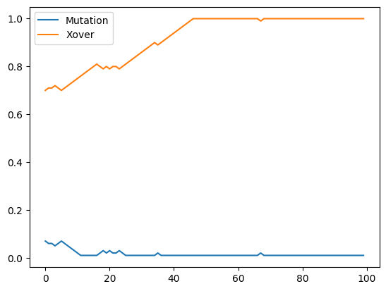

# Parameter Control and Adaptation


```python
import random
import pprint
import math
import copy
import matplotlib.pyplot as plt

# For presenting as slides
#plt.rcParams['figure.figsize'] = [12, 8]
#plt.rcParams.update({'font.size': 22})
#plt.rcParams['lines.linewidth'] = 3
```

Evolutionary algorithms have many different parameters and implementation choices. There are qualitative parameters in the design of an algorithm (e.g., what representation, what recombination operators, what selection operators, etc.) and quantitative parameters (e.g., mutation rate, crossover rate, selection bias, population size, etc.) So far, we used intuition and common default values for many of these parameters. However, parameters can have a large influence on the performance of an algorithm on a particular problem. This chapter looks at how to optimise the selection of parameter values.

## Example Problem: Pairwise Testing

As an example search problem we will consider pairwise testing, a form of combinatorial interaction testing where we want to generate covering arrays of strength 2. The problem is as follows: We are testing a system with _x_ parameters, each parameter can have a different number of parameter values. In order to properly test the system, we would need to check all possible combinations of parameter values, but the combinatorial explosion usually makes this practically impossible. Since most failures are triggered by combinations of only few parameter values, the idea of pairwise testing is to try to cover all combinations of values for any pair of 2 parameters, which greatly reduces the number of tests.

We'll use a very basic genetic algorithm to solve the problem. We'll use our wrapper class because we will be caching some values later on:


```python
class L(list):
    """
    A subclass of list that can accept additional attributes.
    Should be able to be used just like a regular list.
    """
    def __new__(self, *args, **kwargs):
        return super(L, self).__new__(self, args, kwargs)

    def __init__(self, *args, **kwargs):
        if len(args) == 1 and hasattr(args[0], '__iter__'):
            list.__init__(self, args[0])
        else:
            list.__init__(self, args)
        self.__dict__.update(kwargs)

    def __call__(self, **kwargs):
        self.__dict__.update(kwargs)
        return self
```

Let's assume we have a system with a number of parameters, each with a number of possible values:


```python
parameters = { 0 : ["a", "b", "c", "d", "x"],
               1 : ["d", "e", "f", "g", "x"],
               2 : ["g", "h", "i", "j", "x"],
               3 : ["g", "h", "i", "j", "x"],
               4 : ["g", "h", "i", "j", "x"],
               5 : ["j", "k", "l", "m", "x"]}
```

A test case is a list of values, one for each parameter of our system:


```python
def get_random_test():
    num_params = len(parameters)
    test = []
    for p in range(num_params):
        test.append(random.choice(parameters[p]))
    return test
```

The aim of our optimisation problem is to produce a set of tests that covers as many as possible combinations of parameter-value pairs, at the same time we don't want too many test cases. In principle we could make this a multi-objective problem and optimise for size and coverage, but to simplify our examples we will just assume a fixed number of tests, and try to cover as many as possible pairs with that exact number of tests:


```python
num_tests = 25
```

An individual of our search is a list of `num_tests` of such tests:


```python
def get_random_solution():
    solution = L([])
    for test in range(num_tests):
        solution.append(get_random_test())
    return solution
```

As a simple (though maybe somewhat computationally inefficient) fitness function we count how many distinct pairs of pairwise parameter-value combinations we are covering by putting them in a set and then counting the size. The larger the set, the more pairs we have covered:


```python
def get_fitness(individual):
    pairs = set()

    for num1 in range(len(parameters) - 1):
        for num2 in range(num1 + 1, len(parameters)):
            for row in individual:
                pairs.add((num1, num2, row[num1], row[num2]))

    return len(pairs)
```

In previous chapters, the parameters were dispersed throughout the notebooks with some global variables. Since we are focusing on parameters now, we will store them explicitly in a dictionary. Let's set some default values:


```python
configuration = {
    "P_xover": 0.7,
    "P_mutation": 0.07,
    "population_size": 100,
    "tournament_size": 2
}
```

We are only optimising quantitative parameters, so the operators will be the ones we've used previously, adapted only to make use of our configuration dictionary:


```python
def tournament_selection(population):
    # Make sure the sample isn't larger than the population
    candidates = random.sample(population, min(len(population), configuration["tournament_size"]))
    winner = max(candidates, key=lambda x: get_fitness(x))    
                
    return winner
```

We'll use single-point crossover for tests, and just need to make sure to preserve our wrapper classes:


```python
def crossover(parent1, parent2):
    pos = random.randint(1, len(parent1))

    offspring1 = L(copy.deepcopy(parent1[:pos] + parent2[pos:]))
    offspring2 = L(copy.deepcopy(parent2[:pos] + parent1[pos:]))

    return offspring1, offspring2
```

In the past we dynamically set the mutation rate based on the size of individuals. To make it easier to evaluate the effects of the mutation rate parameter, we will now set it explicitly. Each parameter in our list of tests is replaced with a different parameter value with that probability. We'll pass in the probability as a parameter rather and read the value of the configuration dictionary outside the operator.


```python
def mutate(individual, P_mutate):
    mutated = L(copy.deepcopy(individual))
    for num_row in range(len(mutated)):
        for num_col in range(len(parameters)):
            if random.random() < P_mutate:
                choice = parameters[num_col][:]
                choice.remove(mutated[num_row][num_col])
                mutated[num_row][num_col] = random.choice(choice)

    return mutated
```

The reproduction-related probabilities are considered during a step of our algorithm:


```python
def evolution_step(population):
    new_population = []
    
    while len(new_population) < len(population):
        parent1 = selection(population)
        parent2 = selection(population)

        if random.random() < configuration["P_xover"]:
            offspring1, offspring2 = crossover(parent1, parent2)
        else:
            offspring1, offspring2 = parent1, parent2

        offspring1 = mutate(offspring1, configuration["P_mutation"])
        offspring2 = mutate(offspring2, configuration["P_mutation"])

        new_population.append(offspring1)
        new_population.append(offspring2)

    population.clear()
    population.extend(new_population)
```

Finally, we'll just set some parameters and global variables for our experiments, such as the list of fitness values to observe what happened, and the number of fitness evaluations as our stopping criterion:


```python
max_evaluations = 10000
selection = tournament_selection
fitness_values = []
```

The algorithm itself should by now be well known:


```python
def ga():
    population = [get_random_solution() for _ in range(configuration["population_size"])]
    best_individual = max(population, key=lambda k: get_fitness(k))
    best_fitness = get_fitness(best_individual)
    print(f"Initial population, best fitness: {best_fitness}")

    iteration = 0
    while iteration < (max_evaluations / configuration["population_size"]):
        fitness_values.append(best_fitness)
        iteration += 1
        evolution_step(population)
        current_best = max(population, key=lambda k: get_fitness(k))
        current_fitness = get_fitness(current_best)
        if current_fitness > best_fitness:
            print(f"Iteration {iteration}, best fitness: {best_fitness}")
            best_individual = copy.deepcopy(current_best)
            best_fitness = current_fitness

    fitness_values.append(best_fitness)
    return best_individual
```

We can now run our algorithm and look at the resulting test suite:


```python
fitness_values = []
solution = ga()

# Pretty print output
pp = pprint.PrettyPrinter(depth=6)
solution.sort()
pp.pprint(solution)
print(len(solution))
```

    Initial population, best fitness: 262
    Iteration 1, best fitness: 262
    Iteration 11, best fitness: 266
    Iteration 21, best fitness: 267
    Iteration 39, best fitness: 268
    Iteration 40, best fitness: 269
    [['a', 'f', 'x', 'h', 'x', 'j'],
     ['a', 'g', 'g', 'g', 'x', 'm'],
     ['a', 'g', 'j', 'g', 'i', 'x'],
     ['a', 'g', 'x', 'j', 'g', 'l'],
     ['a', 'x', 'j', 'x', 'x', 'k'],
     ['b', 'd', 'j', 'j', 'i', 'k'],
     ['b', 'e', 'g', 'h', 'j', 'l'],
     ['b', 'e', 'g', 'i', 'i', 'x'],
     ['b', 'f', 'h', 'x', 'x', 'j'],
     ['b', 'g', 'j', 'h', 'x', 'm'],
     ['c', 'd', 'g', 'h', 'g', 'j'],
     ['c', 'd', 'h', 'h', 'j', 'm'],
     ['c', 'f', 'i', 'i', 'h', 'l'],
     ['c', 'g', 'h', 'x', 'j', 'x'],
     ['d', 'd', 'h', 'j', 'h', 'k'],
     ['d', 'd', 'j', 'i', 'g', 'l'],
     ['d', 'f', 'i', 'j', 'j', 'm'],
     ['d', 'g', 'x', 'x', 'g', 'l'],
     ['d', 'x', 'h', 'x', 'i', 'x'],
     ['d', 'x', 'x', 'g', 'h', 'j'],
     ['x', 'd', 'x', 'h', 'i', 'x'],
     ['x', 'e', 'g', 'x', 'h', 'm'],
     ['x', 'e', 'h', 'j', 'x', 'l'],
     ['x', 'f', 'j', 'g', 'g', 'j'],
     ['x', 'x', 'h', 'i', 'x', 'k']]
    25


```python
plt.plot(fitness_values, label="Fitness")
plt.legend()
```


    <matplotlib.legend.Legend at 0x11dd56c80>


    

    


## Parameter Tuning

Tuning refers to a (systematic) process of optimising the values of the parameters of our algorithm. There are many considerations when doing so: Which parameters, and which levels? We can't look at all possible values for our parameters, so we will have to consider some relevant values. For example, let's consider the following parameters and their possible values:


```python
search_parameters = {
    "population_size": [5, 37, 52, 67, 99],
    "tournament_size": [1, 2, 3, 4, 5],
    "P_mutation": [0.01, 0.34, 0.5, 0.65, 0.99],
    "P_xover": [0.01, 0.34, 0.5, 0.65, 0.99]
}
```

To find the best configuration based on these options, one way is to produce a factorial design, i.e., a combination of all possible values (very similar to the example problem we are solving with search in this chapter!) Let's define a function that produces such a factorial design:


```python
def get_factorial_design(search_parameters):
    configurations = [{}]
    
    for parameter in search_parameters.keys():
        new_configurations = []
        for configuration in configurations:
            for option in range(len(search_parameters[parameter])):
                cp = configuration.copy()
                cp[parameter] = search_parameters[parameter][option]
                new_configurations.append(cp)
            
        configurations = new_configurations
    
    return configurations
```

For our choice of parameters and values, this is the resulting factorial design:


```python
# This produces a loooong list...
# get_factorial_design(search_parameters)
```


```python
len(get_factorial_design(search_parameters))
```


    625


In order to find the best parameter setting, we would have to run the search on some example problems for each of these configurations. That would take very long, so one option is to produce a fractional factorial design where we omit or restrict certain combinations. Let's simply reduce the value choices to 2 per parameter:


```python
search_parameters = {
    "population_size": [20, 100],
    "tournament_size": [1, 3],
    "P_mutation": [0.01, 0.5],
    "P_xover": [0.0, 0.7]
}
```


```python
len(get_factorial_design(search_parameters))
```


    16


In order to evaluate how well each of the configurations performs, we need to define what _performance_ actually means. A simple measurement of performance is given by the fitness value of the resulting solution. However, since the algorithm is randomised, we need to apply it repeatedly. Furthermore, we need to choose which problem instances to evaluate the algorithm on. To keep things simple, we will only consider the specific problem listed earlier, and we'll measure the performance as the average of the best fitness values for a number of repetitions:


```python
from IPython.utils import io
def get_performance(config):
    global max_evaluations
    results = []
    repetitions = 4 # Should be more, but to accelerate the notebook...
    old_evaluations = max_evaluations
    max_evaluations = 3000 # Should be more, but to accelerate the notebook...
    for i in range(repetitions):
        fitness_values = []
        configuration.update(config)
        with io.capture_output() as captured: 
            result = ga()
            fitness = get_fitness(result)
        results.append(fitness)
    max_evaluations = old_evaluations
    return sum(results)/len(results)
```

Now we just have to consider each configuration of our factorial design and measure the performance. The best configuration is the one with the best performance:


```python
best_config = None
best_performance = 0
#max_evaluations = 10000 # Limit number of fitness evaluations so we don't have to wait too long
for config in get_factorial_design(search_parameters):
    print(f"Current configuration: {config}")
    performance = get_performance(config)
    print(f"Performance: {performance}")
    if performance > best_performance:
        best_config = config
        best_performance = performance

print(f"Chosen best configuration: {best_config}")
configuration.update(best_config)
```

    Current configuration: {'population_size': 20, 'tournament_size': 1, 'P_mutation': 0.01, 'P_xover': 0.0}
    Performance: 266.25
    Current configuration: {'population_size': 20, 'tournament_size': 1, 'P_mutation': 0.01, 'P_xover': 0.7}
    Performance: 262.5
    Current configuration: {'population_size': 20, 'tournament_size': 1, 'P_mutation': 0.5, 'P_xover': 0.0}
    Performance: 267.75
    Current configuration: {'population_size': 20, 'tournament_size': 1, 'P_mutation': 0.5, 'P_xover': 0.7}
    Performance: 267.25
    Current configuration: {'population_size': 20, 'tournament_size': 3, 'P_mutation': 0.01, 'P_xover': 0.0}
    Performance: 300.25
    Current configuration: {'population_size': 20, 'tournament_size': 3, 'P_mutation': 0.01, 'P_xover': 0.7}
    Performance: 305.25
    Current configuration: {'population_size': 20, 'tournament_size': 3, 'P_mutation': 0.5, 'P_xover': 0.0}
    Performance: 271.0
    Current configuration: {'population_size': 20, 'tournament_size': 3, 'P_mutation': 0.5, 'P_xover': 0.7}
    Performance: 267.5
    Current configuration: {'population_size': 100, 'tournament_size': 1, 'P_mutation': 0.01, 'P_xover': 0.0}
    Performance: 262.75
    Current configuration: {'population_size': 100, 'tournament_size': 1, 'P_mutation': 0.01, 'P_xover': 0.7}
    Performance: 267.0
    Current configuration: {'population_size': 100, 'tournament_size': 1, 'P_mutation': 0.5, 'P_xover': 0.0}
    Performance: 270.0
    Current configuration: {'population_size': 100, 'tournament_size': 1, 'P_mutation': 0.5, 'P_xover': 0.7}
    Performance: 268.0
    Current configuration: {'population_size': 100, 'tournament_size': 3, 'P_mutation': 0.01, 'P_xover': 0.0}
    Performance: 292.25
    Current configuration: {'population_size': 100, 'tournament_size': 3, 'P_mutation': 0.01, 'P_xover': 0.7}
    Performance: 292.5
    Current configuration: {'population_size': 100, 'tournament_size': 3, 'P_mutation': 0.5, 'P_xover': 0.0}
    Performance: 268.5
    Current configuration: {'population_size': 100, 'tournament_size': 3, 'P_mutation': 0.5, 'P_xover': 0.7}
    Performance: 266.75
    Chosen best configuration: {'population_size': 20, 'tournament_size': 3, 'P_mutation': 0.01, 'P_xover': 0.7}


Finding vectors of parameter values is a complex optimisation task. Our performance function defines a _utility landscape_ -- an abstract landscape where the locations are the parameter vectors of an EA and the height reflects the utility (performance). Thus, technically we can treat our tuning problem as a search problem. To do so, we'll define range limits for the parameters we are optimising:


```python
search_parameter_ranges = {
    "population_size": [1, 100],
    "tournament_size": [1, 5],
    "P_mutation": [0.0, 0.2],
    "P_xover": [0.0, 1.0]
}
```

In order to apply meta-heuristic search to the problem of optimising the parameters of a meta-heuristic search algorithm, we need to define a representation, which is a parameter vector. We'll define a helper function that gives us a random value for a chosen parameter, using the range limits defined above:


```python
def get_random_parameter(parameter_name):
    value = random.uniform(*search_parameter_ranges[parameter_name])
    if type(1) == type(search_parameter_ranges[parameter_name][0]):
        value = int(value)
    return value
```

An individual of our parameter-search is a dictionary of parameter values:


```python
def get_random_configuration():
    config = {}
    for param in search_parameter_ranges.keys():
        config[param] = get_random_parameter(param)
    return config
```


```python
get_random_configuration()
```


    {'population_size': 17,
     'tournament_size': 3,
     'P_mutation': 0.18821314665919514,
     'P_xover': 0.8789577455737613}


A very basic mutation of parameter dictionaries is to replace individual parameters with different values.


```python
def mutate_configuration(config):
    copy = config.copy()
    P_mutate = 1/len(copy)
    while copy == config:
        for key in copy.keys():
            if random.random() < P_mutate:
                copy[key] = get_random_parameter(key)

    return copy
```

Technically, we can use any search algorithm for this optimisation problem. However, measuring fitness requires running our `get_performance` function, which is expensive. Thus, some algorithms are better suited than others. One popular algorithm in practice is _differential evolution_, which we haven't covered yet, so to keep things simple we'll just use a (1+1)EA:


```python
def oneplusone():
    current = best_config #get_random_configuration()
    fitness = get_performance(current)
    iteration = 0
    print(f"Iteration {iteration}: Fitness {fitness} - {current}")

    while iteration < max_steps:
        iteration += 1
        candidate = mutate_configuration(current)
        candidate_fitness = get_performance(candidate)
        print(f"Iteration {iteration}: Fitness {candidate_fitness} - {candidate}")
        if candidate_fitness >= fitness:
            current = candidate
            fitness = candidate_fitness
        fitness_values.append(fitness)

    return current
```


```python
max_steps = 20
tuned_opo = oneplusone()
tuned_opo
```

    Iteration 0: Fitness 306.75 - {'population_size': 20, 'tournament_size': 3, 'P_mutation': 0.01, 'P_xover': 0.7}
    Iteration 1: Fitness 274.0 - {'population_size': 20, 'tournament_size': 3, 'P_mutation': 0.08661464615716781, 'P_xover': 0.7}
    Iteration 2: Fitness 272.5 - {'population_size': 20, 'tournament_size': 3, 'P_mutation': 0.10872164994724925, 'P_xover': 0.7}
    Iteration 3: Fitness 291.75 - {'population_size': 20, 'tournament_size': 2, 'P_mutation': 0.01, 'P_xover': 0.10875596742655302}
    Iteration 4: Fitness 307.25 - {'population_size': 20, 'tournament_size': 3, 'P_mutation': 0.01, 'P_xover': 0.8418729461113189}
    Iteration 5: Fitness 274.5 - {'population_size': 20, 'tournament_size': 3, 'P_mutation': 0.08145624198300644, 'P_xover': 0.7136235550323384}
    Iteration 6: Fitness 270.25 - {'population_size': 20, 'tournament_size': 3, 'P_mutation': 0.1439620304504634, 'P_xover': 0.8418729461113189}
    Iteration 7: Fitness 279.0 - {'population_size': 20, 'tournament_size': 3, 'P_mutation': 0.049871092036983436, 'P_xover': 0.8418729461113189}
    Iteration 8: Fitness 299.0 - {'population_size': 26, 'tournament_size': 2, 'P_mutation': 0.01, 'P_xover': 0.8418729461113189}
    Iteration 9: Fitness 296.75 - {'population_size': 76, 'tournament_size': 3, 'P_mutation': 0.01, 'P_xover': 0.8418729461113189}
    Iteration 10: Fitness 269.5 - {'population_size': 73, 'tournament_size': 3, 'P_mutation': 0.16271870093664825, 'P_xover': 0.8418729461113189}
    Iteration 11: Fitness 310.0 - {'population_size': 20, 'tournament_size': 4, 'P_mutation': 0.01, 'P_xover': 0.10903764476138955}
    Iteration 12: Fitness 304.25 - {'population_size': 20, 'tournament_size': 3, 'P_mutation': 0.01, 'P_xover': 0.10903764476138955}
    Iteration 13: Fitness 303.5 - {'population_size': 59, 'tournament_size': 4, 'P_mutation': 0.01, 'P_xover': 0.10903764476138955}
    Iteration 14: Fitness 273.5 - {'population_size': 20, 'tournament_size': 4, 'P_mutation': 0.10454386589938292, 'P_xover': 0.10903764476138955}
    Iteration 15: Fitness 274.5 - {'population_size': 20, 'tournament_size': 4, 'P_mutation': 0.08987825416817007, 'P_xover': 0.10903764476138955}
    Iteration 16: Fitness 270.75 - {'population_size': 20, 'tournament_size': 4, 'P_mutation': 0.19823797136307506, 'P_xover': 0.10903764476138955}
    Iteration 17: Fitness 273.25 - {'population_size': 20, 'tournament_size': 4, 'P_mutation': 0.10672980250780446, 'P_xover': 0.10903764476138955}
    Iteration 18: Fitness 311.5 - {'population_size': 20, 'tournament_size': 4, 'P_mutation': 0.01, 'P_xover': 0.4763607875672956}
    Iteration 19: Fitness 277.25 - {'population_size': 20, 'tournament_size': 4, 'P_mutation': 0.07649543230763463, 'P_xover': 0.4763607875672956}
    Iteration 20: Fitness 307.5 - {'population_size': 20, 'tournament_size': 4, 'P_mutation': 0.01, 'P_xover': 0.19367168734192586}


    {'population_size': 20,
     'tournament_size': 4,
     'P_mutation': 0.01,
     'P_xover': 0.4763607875672956}


To reduce the enormous costs of fitness evaluations in this search, the _response surface methodology_ systematically samples the utility space, creates a regression model that predicts the utility for parameter values, and then uses this regression model as a surrogate for querying the performance.

As an alternative to a full factorial design, the response surface methodology is often performed using a _central composite design_. For the central composite design we obtain five levels for each parameter: {0, 1, −1, α, −α}.

The design consists of three matrices:
- A factorial design with two levels for each factor (1, -1)
- A set of center points (0)
- A set of axial points, configurations identical to the centre points except for one factor that is varied with values below and above the median (α, −α).

(The choice of 1, -1, α, -α is actually more complicated, but out of scope for this notebook)

For example, assume we have derived the following levels (-α, -1, 0, 1, α) for our factors:


```python
search_parameters = {
    "population_size": [5, 37, 52, 67, 99],
    "tournament_size": [1, 2, 3, 4, 5],
    "P_mutation": [0.005, 0.01, 0.05, 0.1, 0.2],
    "P_xover": [0.01, 0.34, 0.5, 0.65, 0.99]
}
```

We will define helper functions that produce the three component matrices:


```python
def get_factorial_for(search_parameters, options = [1, 3]):
    configurations = [{}]
    
    for parameter in search_parameters.keys():
        new_configurations = []
        for configuration in configurations:
            for option in options:
                cp = configuration.copy()
                cp[parameter] = search_parameters[parameter][option]
                new_configurations.append(cp)
            
        configurations = new_configurations
    
    return configurations
```


```python
get_factorial_for(search_parameters)
```


    [{'population_size': 37,
      'tournament_size': 2,
      'P_mutation': 0.01,
      'P_xover': 0.34},
     {'population_size': 37,
      'tournament_size': 2,
      'P_mutation': 0.01,
      'P_xover': 0.65},
     {'population_size': 37,
      'tournament_size': 2,
      'P_mutation': 0.1,
      'P_xover': 0.34},
     {'population_size': 37,
      'tournament_size': 2,
      'P_mutation': 0.1,
      'P_xover': 0.65},
     {'population_size': 37,
      'tournament_size': 4,
      'P_mutation': 0.01,
      'P_xover': 0.34},
     {'population_size': 37,
      'tournament_size': 4,
      'P_mutation': 0.01,
      'P_xover': 0.65},
     {'population_size': 37,
      'tournament_size': 4,
      'P_mutation': 0.1,
      'P_xover': 0.34},
     {'population_size': 37,
      'tournament_size': 4,
      'P_mutation': 0.1,
      'P_xover': 0.65},
     {'population_size': 67,
      'tournament_size': 2,
      'P_mutation': 0.01,
      'P_xover': 0.34},
     {'population_size': 67,
      'tournament_size': 2,
      'P_mutation': 0.01,
      'P_xover': 0.65},
     {'population_size': 67,
      'tournament_size': 2,
      'P_mutation': 0.1,
      'P_xover': 0.34},
     {'population_size': 67,
      'tournament_size': 2,
      'P_mutation': 0.1,
      'P_xover': 0.65},
     {'population_size': 67,
      'tournament_size': 4,
      'P_mutation': 0.01,
      'P_xover': 0.34},
     {'population_size': 67,
      'tournament_size': 4,
      'P_mutation': 0.01,
      'P_xover': 0.65},
     {'population_size': 67,
      'tournament_size': 4,
      'P_mutation': 0.1,
      'P_xover': 0.34},
     {'population_size': 67,
      'tournament_size': 4,
      'P_mutation': 0.1,
      'P_xover': 0.65}]


```python
def get_center_point(parameters, center = 2):
    configuration = {}
    for parameter in parameters.keys():
        configuration[parameter] = parameters[parameter][center]
    return configuration
```


```python
get_center_point(search_parameters)
```


    {'population_size': 52,
     'tournament_size': 3,
     'P_mutation': 0.05,
     'P_xover': 0.5}


```python
def get_axial_points(parameters, axial_points = [0, 4]):
    configurations = []
    
    for parameter in parameters.keys():
        for axial_point in axial_points:
            configuration = get_center_point(parameters)
            configuration[parameter] = parameters[parameter][axial_point]
            configurations.append(configuration)
    return configurations
```


```python
get_axial_points(search_parameters)
```


    [{'population_size': 5,
      'tournament_size': 3,
      'P_mutation': 0.05,
      'P_xover': 0.5},
     {'population_size': 99,
      'tournament_size': 3,
      'P_mutation': 0.05,
      'P_xover': 0.5},
     {'population_size': 52,
      'tournament_size': 1,
      'P_mutation': 0.05,
      'P_xover': 0.5},
     {'population_size': 52,
      'tournament_size': 5,
      'P_mutation': 0.05,
      'P_xover': 0.5},
     {'population_size': 52,
      'tournament_size': 3,
      'P_mutation': 0.005,
      'P_xover': 0.5},
     {'population_size': 52,
      'tournament_size': 3,
      'P_mutation': 0.2,
      'P_xover': 0.5},
     {'population_size': 52,
      'tournament_size': 3,
      'P_mutation': 0.05,
      'P_xover': 0.01},
     {'population_size': 52,
      'tournament_size': 3,
      'P_mutation': 0.05,
      'P_xover': 0.99}]


The full central composite design now consists of all three of these:


```python
configurations = get_factorial_for(search_parameters) + \
    [ get_center_point(search_parameters) ] + \
    get_axial_points(search_parameters)
```


```python
len(configurations)
```


    25


Now we need some patience while we determine the performance for each of these configurations:


```python
responses = []
max_evaluations = 10000
for config in configurations:
    r = get_performance(config)
    config["performance"] = r
    print(config)
    responses.append(r)
```

    {'population_size': 37, 'tournament_size': 2, 'P_mutation': 0.01, 'P_xover': 0.34, 'performance': 291.5}
    {'population_size': 37, 'tournament_size': 2, 'P_mutation': 0.01, 'P_xover': 0.65, 'performance': 294.25}
    {'population_size': 37, 'tournament_size': 2, 'P_mutation': 0.1, 'P_xover': 0.34, 'performance': 272.0}
    {'population_size': 37, 'tournament_size': 2, 'P_mutation': 0.1, 'P_xover': 0.65, 'performance': 271.25}
    {'population_size': 37, 'tournament_size': 4, 'P_mutation': 0.01, 'P_xover': 0.34, 'performance': 308.75}
    {'population_size': 37, 'tournament_size': 4, 'P_mutation': 0.01, 'P_xover': 0.65, 'performance': 308.5}
    {'population_size': 37, 'tournament_size': 4, 'P_mutation': 0.1, 'P_xover': 0.34, 'performance': 276.75}
    {'population_size': 37, 'tournament_size': 4, 'P_mutation': 0.1, 'P_xover': 0.65, 'performance': 274.0}
    {'population_size': 67, 'tournament_size': 2, 'P_mutation': 0.01, 'P_xover': 0.34, 'performance': 286.25}
    {'population_size': 67, 'tournament_size': 2, 'P_mutation': 0.01, 'P_xover': 0.65, 'performance': 287.75}
    {'population_size': 67, 'tournament_size': 2, 'P_mutation': 0.1, 'P_xover': 0.34, 'performance': 269.75}
    {'population_size': 67, 'tournament_size': 2, 'P_mutation': 0.1, 'P_xover': 0.65, 'performance': 271.5}
    {'population_size': 67, 'tournament_size': 4, 'P_mutation': 0.01, 'P_xover': 0.34, 'performance': 304.0}
    {'population_size': 67, 'tournament_size': 4, 'P_mutation': 0.01, 'P_xover': 0.65, 'performance': 306.0}
    {'population_size': 67, 'tournament_size': 4, 'P_mutation': 0.1, 'P_xover': 0.34, 'performance': 274.5}
    {'population_size': 67, 'tournament_size': 4, 'P_mutation': 0.1, 'P_xover': 0.65, 'performance': 272.75}
    {'population_size': 52, 'tournament_size': 3, 'P_mutation': 0.05, 'P_xover': 0.5, 'performance': 276.75}
    {'population_size': 5, 'tournament_size': 3, 'P_mutation': 0.05, 'P_xover': 0.5, 'performance': 278.75}
    {'population_size': 99, 'tournament_size': 3, 'P_mutation': 0.05, 'P_xover': 0.5, 'performance': 277.25}
    {'population_size': 52, 'tournament_size': 1, 'P_mutation': 0.05, 'P_xover': 0.5, 'performance': 268.5}
    {'population_size': 52, 'tournament_size': 5, 'P_mutation': 0.05, 'P_xover': 0.5, 'performance': 282.0}
    {'population_size': 52, 'tournament_size': 3, 'P_mutation': 0.005, 'P_xover': 0.5, 'performance': 306.5}
    {'population_size': 52, 'tournament_size': 3, 'P_mutation': 0.2, 'P_xover': 0.5, 'performance': 270.25}
    {'population_size': 52, 'tournament_size': 3, 'P_mutation': 0.05, 'P_xover': 0.01, 'performance': 279.25}
    {'population_size': 52, 'tournament_size': 3, 'P_mutation': 0.05, 'P_xover': 0.99, 'performance': 275.0}


The next step is to create a regression model that predicts the performance of any given combination of parameter values. We'll cut this short and simply throw our data at a multilayer perceptron regression model, and doing this properly and checking the fit of the model are left as an exercise.


```python
import numpy as np
import pandas as pd
from sklearn.neural_network import MLPRegressor
```


```python
model = MLPRegressor(solver="lbfgs", max_iter=1000)
```


```python
df = pd.DataFrame(configurations)
y = df['performance'].values
x = df[['population_size', 'tournament_size', 'P_mutation', 'P_xover']].values
# This will need some adjusting...
model.fit(x, y)
```


<style>#sk-container-id-1 {color: black;background-color: white;}#sk-container-id-1 pre{padding: 0;}#sk-container-id-1 div.sk-toggleable {background-color: white;}#sk-container-id-1 label.sk-toggleable__label {cursor: pointer;display: block;width: 100%;margin-bottom: 0;padding: 0.3em;box-sizing: border-box;text-align: center;}#sk-container-id-1 label.sk-toggleable__label-arrow:before {content: "▸";float: left;margin-right: 0.25em;color: #696969;}#sk-container-id-1 label.sk-toggleable__label-arrow:hover:before {color: black;}#sk-container-id-1 div.sk-estimator:hover label.sk-toggleable__label-arrow:before {color: black;}#sk-container-id-1 div.sk-toggleable__content {max-height: 0;max-width: 0;overflow: hidden;text-align: left;background-color: #f0f8ff;}#sk-container-id-1 div.sk-toggleable__content pre {margin: 0.2em;color: black;border-radius: 0.25em;background-color: #f0f8ff;}#sk-container-id-1 input.sk-toggleable__control:checked~div.sk-toggleable__content {max-height: 200px;max-width: 100%;overflow: auto;}#sk-container-id-1 input.sk-toggleable__control:checked~label.sk-toggleable__label-arrow:before {content: "▾";}#sk-container-id-1 div.sk-estimator input.sk-toggleable__control:checked~label.sk-toggleable__label {background-color: #d4ebff;}#sk-container-id-1 div.sk-label input.sk-toggleable__control:checked~label.sk-toggleable__label {background-color: #d4ebff;}#sk-container-id-1 input.sk-hidden--visually {border: 0;clip: rect(1px 1px 1px 1px);clip: rect(1px, 1px, 1px, 1px);height: 1px;margin: -1px;overflow: hidden;padding: 0;position: absolute;width: 1px;}#sk-container-id-1 div.sk-estimator {font-family: monospace;background-color: #f0f8ff;border: 1px dotted black;border-radius: 0.25em;box-sizing: border-box;margin-bottom: 0.5em;}#sk-container-id-1 div.sk-estimator:hover {background-color: #d4ebff;}#sk-container-id-1 div.sk-parallel-item::after {content: "";width: 100%;border-bottom: 1px solid gray;flex-grow: 1;}#sk-container-id-1 div.sk-label:hover label.sk-toggleable__label {background-color: #d4ebff;}#sk-container-id-1 div.sk-serial::before {content: "";position: absolute;border-left: 1px solid gray;box-sizing: border-box;top: 0;bottom: 0;left: 50%;z-index: 0;}#sk-container-id-1 div.sk-serial {display: flex;flex-direction: column;align-items: center;background-color: white;padding-right: 0.2em;padding-left: 0.2em;position: relative;}#sk-container-id-1 div.sk-item {position: relative;z-index: 1;}#sk-container-id-1 div.sk-parallel {display: flex;align-items: stretch;justify-content: center;background-color: white;position: relative;}#sk-container-id-1 div.sk-item::before, #sk-container-id-1 div.sk-parallel-item::before {content: "";position: absolute;border-left: 1px solid gray;box-sizing: border-box;top: 0;bottom: 0;left: 50%;z-index: -1;}#sk-container-id-1 div.sk-parallel-item {display: flex;flex-direction: column;z-index: 1;position: relative;background-color: white;}#sk-container-id-1 div.sk-parallel-item:first-child::after {align-self: flex-end;width: 50%;}#sk-container-id-1 div.sk-parallel-item:last-child::after {align-self: flex-start;width: 50%;}#sk-container-id-1 div.sk-parallel-item:only-child::after {width: 0;}#sk-container-id-1 div.sk-dashed-wrapped {border: 1px dashed gray;margin: 0 0.4em 0.5em 0.4em;box-sizing: border-box;padding-bottom: 0.4em;background-color: white;}#sk-container-id-1 div.sk-label label {font-family: monospace;font-weight: bold;display: inline-block;line-height: 1.2em;}#sk-container-id-1 div.sk-label-container {text-align: center;}#sk-container-id-1 div.sk-container {/* jupyter's `normalize.less` sets `[hidden] { display: none; }` but bootstrap.min.css set `[hidden] { display: none !important; }` so we also need the `!important` here to be able to override the default hidden behavior on the sphinx rendered scikit-learn.org. See: https://github.com/scikit-learn/scikit-learn/issues/21755 */display: inline-block !important;position: relative;}#sk-container-id-1 div.sk-text-repr-fallback {display: none;}</style><div id="sk-container-id-1" class="sk-top-container"><div class="sk-text-repr-fallback"><pre>MLPRegressor(max_iter=1000, solver=&#x27;lbfgs&#x27;)</pre><b>In a Jupyter environment, please rerun this cell to show the HTML representation or trust the notebook. <br />On GitHub, the HTML representation is unable to render, please try loading this page with nbviewer.org.</b></div><div class="sk-container" hidden><div class="sk-item"><div class="sk-estimator sk-toggleable"><input class="sk-toggleable__control sk-hidden--visually" id="sk-estimator-id-1" type="checkbox" checked><label for="sk-estimator-id-1" class="sk-toggleable__label sk-toggleable__label-arrow">MLPRegressor</label><div class="sk-toggleable__content"><pre>MLPRegressor(max_iter=1000, solver=&#x27;lbfgs&#x27;)</pre></div></div></div></div></div>


We can now take any configuration and query the model. For example, let's query the configuration we determined best with our simplified factorial design initially:


```python
model.predict([list(best_config.values())])
```


    array([297.8607366])


We'll use a (1+1)EA again to do the search, but instead of querying the fitness function, we query the model:


```python
def surrogate_oneplusone():
    current = best_config #get_random_configuration()
    fitness = model.predict([list(current.values())])[0]
    iteration = 0
    print(f"Iteration {iteration}: Fitness {fitness} - {current}")

    while iteration < max_steps:
        iteration += 1
        candidate = mutate_configuration(current)
        candidate_fitness = model.predict([list(candidate.values())])[0]
        if candidate_fitness >= fitness:
            if candidate_fitness > fitness:
                print(f"Iteration {iteration}: Fitness {candidate_fitness} - {candidate}")
                
            current = candidate
            fitness = candidate_fitness
        fitness_values.append(fitness)

    return current
```

Since querying the model is very cheap compared to measuring the actual performance, we can run many more iterations of the search algorithm.


```python
max_steps = 1000
rsm_config = surrogate_oneplusone()
```

    Iteration 0: Fitness 297.8607366026303 - {'population_size': 20, 'tournament_size': 3, 'P_mutation': 0.01, 'P_xover': 0.7}
    Iteration 5: Fitness 297.8917607596257 - {'population_size': 20, 'tournament_size': 3, 'P_mutation': 0.01, 'P_xover': 0.6850271258933945}
    Iteration 13: Fitness 299.28277487548166 - {'population_size': 20, 'tournament_size': 3, 'P_mutation': 0.01, 'P_xover': 0.013696096966332227}
    Iteration 15: Fitness 303.7828027167627 - {'population_size': 20, 'tournament_size': 4, 'P_mutation': 0.01, 'P_xover': 0.013696096966332227}
    Iteration 57: Fitness 304.9498884781121 - {'population_size': 11, 'tournament_size': 4, 'P_mutation': 0.01, 'P_xover': 0.013696096966332227}
    Iteration 125: Fitness 305.6560016299672 - {'population_size': 11, 'tournament_size': 4, 'P_mutation': 0.006741018591484571, 'P_xover': 0.013696096966332227}
    Iteration 301: Fitness 306.71585706270133 - {'population_size': 11, 'tournament_size': 4, 'P_mutation': 0.001849381688928342, 'P_xover': 0.013696096966332227}
    Iteration 728: Fitness 306.8455332584065 - {'population_size': 10, 'tournament_size': 4, 'P_mutation': 0.001849381688928342, 'P_xover': 0.013696096966332227}
    Iteration 794: Fitness 306.8628545180537 - {'population_size': 10, 'tournament_size': 4, 'P_mutation': 0.001849381688928342, 'P_xover': 0.00533651317147521}
    Iteration 803: Fitness 307.18744464870593 - {'population_size': 10, 'tournament_size': 4, 'P_mutation': 0.0003512744827331327, 'P_xover': 0.00533651317147521}
    Iteration 829: Fitness 307.188401690043 - {'population_size': 10, 'tournament_size': 4, 'P_mutation': 0.0003512744827331327, 'P_xover': 0.004874626021581507}
    Iteration 870: Fitness 307.19149611591786 - {'population_size': 10, 'tournament_size': 4, 'P_mutation': 0.0003512744827331327, 'P_xover': 0.003381194658956921}


```python
rsm_config
```


    {'population_size': 10,
     'tournament_size': 4,
     'P_mutation': 0.0003512744827331327,
     'P_xover': 0.003381194658956921}


Is the optimised configuration really better? Let's find out by comparing against our initial default values.


```python
configuration['P_xover'] = 0.7
configuration['P_mutation'] = 0.07
configuration['population_size'] = 100
configuration['tournament_size'] = 2

fitness_values = []
ga()
# Stretch this by the population size to make plots comparable
default_fitness = [item for item in fitness_values for i in range(configuration['population_size'])]


configuration.update(tuned_opo)
fitness_values = []
ga()
# Stretch this by the population size to make plots comparable
opo_tuned_fitness = [item for item in fitness_values for i in range(configuration['population_size'])]


configuration.update(rsm_config)
fitness_values = []
ga()
# Stretch this by the population size to make plots comparable
rsm_tuned_fitness = [item for item in fitness_values for i in range(configuration['population_size'])]

```

    Initial population, best fitness: 261
    Iteration 1, best fitness: 261
    Iteration 4, best fitness: 264
    Iteration 6, best fitness: 265
    Iteration 16, best fitness: 267
    Iteration 25, best fitness: 268
    Iteration 35, best fitness: 270
    Iteration 65, best fitness: 271
    Initial population, best fitness: 256
    Iteration 1, best fitness: 256
    Iteration 3, best fitness: 263
    Iteration 4, best fitness: 264
    Iteration 5, best fitness: 265
    Iteration 6, best fitness: 266
    Iteration 7, best fitness: 268
    Iteration 9, best fitness: 269
    Iteration 11, best fitness: 272
    Iteration 12, best fitness: 273
    Iteration 13, best fitness: 274
    Iteration 14, best fitness: 275
    Iteration 17, best fitness: 279
    Iteration 20, best fitness: 280
    Iteration 22, best fitness: 281
    Iteration 23, best fitness: 282
    Iteration 29, best fitness: 283
    Iteration 30, best fitness: 285
    Iteration 32, best fitness: 286
    Iteration 33, best fitness: 288
    Iteration 34, best fitness: 290
    Iteration 36, best fitness: 291
    Iteration 38, best fitness: 293
    Iteration 40, best fitness: 294
    Iteration 42, best fitness: 296
    Iteration 43, best fitness: 297
    Iteration 62, best fitness: 299
    Iteration 63, best fitness: 300
    Iteration 65, best fitness: 301
    Iteration 75, best fitness: 302
    Iteration 85, best fitness: 303
    Iteration 97, best fitness: 304
    Iteration 98, best fitness: 307
    Iteration 116, best fitness: 309
    Iteration 157, best fitness: 310
    Iteration 168, best fitness: 311
    Iteration 255, best fitness: 312
    Iteration 336, best fitness: 313
    Iteration 350, best fitness: 314
    Iteration 353, best fitness: 315
    Iteration 472, best fitness: 316
    Iteration 477, best fitness: 317
    Initial population, best fitness: 247
    Iteration 8, best fitness: 247
    Iteration 15, best fitness: 250
    Iteration 17, best fitness: 251
    Iteration 41, best fitness: 252
    Iteration 47, best fitness: 253
    Iteration 57, best fitness: 255
    Iteration 73, best fitness: 259
    Iteration 74, best fitness: 263
    Iteration 81, best fitness: 266
    Iteration 84, best fitness: 268
    Iteration 108, best fitness: 271
    Iteration 109, best fitness: 272
    Iteration 112, best fitness: 273
    Iteration 122, best fitness: 274
    Iteration 127, best fitness: 275
    Iteration 132, best fitness: 276
    Iteration 133, best fitness: 277
    Iteration 139, best fitness: 278
    Iteration 151, best fitness: 279
    Iteration 155, best fitness: 280
    Iteration 168, best fitness: 282
    Iteration 179, best fitness: 284
    Iteration 184, best fitness: 285
    Iteration 211, best fitness: 286
    Iteration 230, best fitness: 287
    Iteration 258, best fitness: 288
    Iteration 270, best fitness: 289
    Iteration 286, best fitness: 290
    Iteration 299, best fitness: 292
    Iteration 312, best fitness: 293
    Iteration 357, best fitness: 295
    Iteration 368, best fitness: 297
    Iteration 402, best fitness: 300
    Iteration 426, best fitness: 301
    Iteration 475, best fitness: 303
    Iteration 484, best fitness: 304
    Iteration 618, best fitness: 306
    Iteration 656, best fitness: 307
    Iteration 869, best fitness: 308
    Iteration 913, best fitness: 309
    Iteration 962, best fitness: 311


```python
plt.plot(opo_tuned_fitness, label="Tuned (1+1)")
plt.plot(rsm_tuned_fitness, label="Tuned (RSM)")
plt.plot(default_fitness, label="Default")
plt.legend()
```


    <matplotlib.legend.Legend at 0x169db8f40>


    

    


## Parameter Control

There's actually something fundamentally missing in the tuning experiments: We did all our tuning on the exact same problem. That's obviously not what we would do in practice: In order to find good parameters we performed search on that problem; once we have found a good set of parameters we know that it is a good set of parameters because we have found a good solution already, so we don't need to run the search again on that problem. What is missing in our experiments is that we would in practice of course do the tuning on several problems, and then hope that these parameters generalise to other, new problems.

A further limitation of parameter tuning is that it tries to select a good set of parameter values, but these parameters remain constant throughout the search. However, different phases of the search may benefit from different parameter values. For example, during initial phases of the search we may want to put more focus on exploration, thus using higher mutation rates than in later phases (like we saw with the MIO algorithm). Thus, a basic approach to control parameters is to make the parameter values dependent on the phase of the search:


```python
def calculate_probability(size, iteration, max_iterations):
    return math.pow(4 + (size - 2)/(max_iterations - 1) * iteration, -1)
```


```python
mutation_values = [calculate_probability(num_tests*len(parameters), x, 100) for x in range(100)]
plt.plot(mutation_values)
```


    [<matplotlib.lines.Line2D at 0x169e8bbe0>]


    

    


We'll now create a version of the genetic algorithm which doesn't use the mutation rate from our configuration dictionary, but derives it using our probability function:


```python
def controlled_evolution_step(population, P_mutation):
    new_population = []
    
    while len(new_population) < len(population):
        parent1 = selection(population)
        parent2 = selection(population)

        if random.random() < configuration["P_xover"]:
            offspring1, offspring2 = crossover(parent1, parent2)
        else:
            offspring1, offspring2 = parent1, parent2

        offspring1 = mutate(offspring1, P_mutation)
        offspring2 = mutate(offspring2, P_mutation)

        new_population.append(offspring1)
        new_population.append(offspring2)

    population.clear()
    population.extend(new_population)
```


```python
mutation_values = []
def controlled_ga():
    population = [get_random_solution() for _ in range(configuration["population_size"])]
    best_individual = max(population, key=lambda k: get_fitness(k))
    best_fitness = get_fitness(best_individual)
    print(f"Initial population, best fitness: {best_fitness}")

    iteration = 0
    max_iterations = (max_evaluations / configuration["population_size"])
    while iteration < max_iterations:
        fitness_values.append(best_fitness)
        P_mutation = calculate_probability(num_tests * len(parameters), iteration, max_iterations)
        mutation_values.append(P_mutation)
        iteration += 1
        controlled_evolution_step(population, P_mutation)
        current_best = max(population, key=lambda k: get_fitness(k))
        current_fitness = get_fitness(current_best)
        if current_fitness > best_fitness:
            print(f"Iteration {iteration}, best fitness: {best_fitness}")
            best_individual = copy.deepcopy(current_best)
            best_fitness = current_fitness

    fitness_values.append(best_fitness)
    return best_individual
```

As point of reference, we will compare against our initial default values again:


```python
fitness_values = []
mutation_values = []
max_evaluations = 10000

configuration['P_xover'] = 0.7
configuration['P_mutation'] = 0.07
configuration['population_size'] = 100
configuration['tournament_size'] = 2

controlled_ga()
controlled_fitness = fitness_values

fitness_values = []
ga()
```

    Initial population, best fitness: 257
    Iteration 2, best fitness: 257
    Iteration 3, best fitness: 259
    Iteration 4, best fitness: 265
    Iteration 5, best fitness: 266
    Iteration 18, best fitness: 269
    Iteration 23, best fitness: 271
    Iteration 39, best fitness: 273
    Iteration 44, best fitness: 274
    Iteration 45, best fitness: 278
    Iteration 47, best fitness: 279
    Iteration 51, best fitness: 280
    Iteration 52, best fitness: 282
    Iteration 59, best fitness: 283
    Iteration 63, best fitness: 284
    Iteration 76, best fitness: 288
    Iteration 77, best fitness: 291
    Iteration 78, best fitness: 292
    Iteration 79, best fitness: 293
    Iteration 89, best fitness: 296
    Iteration 91, best fitness: 297
    Iteration 93, best fitness: 299
    Initial population, best fitness: 259
    Iteration 1, best fitness: 259
    Iteration 3, best fitness: 263
    Iteration 4, best fitness: 265
    Iteration 7, best fitness: 268


    [['b', 'd', 'i', 'i', 'x', 'l'],
     ['c', 'e', 'h', 'j', 'i', 'l'],
     ['a', 'd', 'x', 'x', 'g', 'l'],
     ['x', 'g', 'g', 'i', 'j', 'x'],
     ['d', 'e', 'j', 'h', 'i', 'j'],
     ['a', 'd', 'i', 'j', 'h', 'j'],
     ['d', 'f', 'x', 'h', 'h', 'm'],
     ['c', 'g', 'x', 'g', 'j', 'j'],
     ['a', 'd', 'j', 'g', 'j', 'l'],
     ['x', 'x', 'i', 'j', 'h', 'j'],
     ['x', 'g', 'x', 'x', 'i', 'l'],
     ['c', 'x', 'g', 'h', 'i', 'k'],
     ['c', 'e', 'i', 'j', 'j', 'x'],
     ['b', 'x', 'g', 'g', 'h', 'k'],
     ['a', 'x', 'g', 'i', 'i', 'm'],
     ['a', 'e', 'h', 'j', 'x', 'k'],
     ['d', 'd', 'i', 'j', 'g', 'l'],
     ['b', 'f', 'g', 'i', 'g', 'l'],
     ['d', 'e', 'h', 'x', 'j', 'x'],
     ['b', 'g', 'j', 'i', 'g', 'j'],
     ['c', 'e', 'x', 'i', 'h', 'k'],
     ['a', 'x', 'x', 'x', 'x', 'k'],
     ['x', 'f', 'j', 'x', 'j', 'x'],
     ['b', 'e', 'g', 'j', 'x', 'j'],
     ['x', 'g', 'h', 'h', 'h', 'l']]


```python
plt.plot(mutation_values, label="Mutation Probability")
plt.legend()
```


    <matplotlib.legend.Legend at 0x169db94b0>


    

    


```python
plt.plot(controlled_fitness, label="Controlled")
plt.plot(fitness_values, label="Regular")
plt.legend()
```


    <matplotlib.legend.Legend at 0x169db86d0>


    

    


## Adaptive Evolutionary Algorithms

The function that we used to control the mutation rate depends only on the phase of the search, but does not consider how the search is performing at any particular point in time. The idea of _adaptive_ parameter control is to adjust parameters based on how well the search is going. As a basic example, if mutation leads to more fitness improvement than crossover, we may want to increase the probability of doing mutation, and reduce the probability of doing crossover, and vice versa. In order to do this, we need to keep track of the fitness values before and after applying these operators:


```python
def adaptive_crossover(parent1, parent2):
    fitness_pre = get_fitness(parent1) + get_fitness(parent2)
    offspring1, offspring2 = crossover(parent1, parent2)
    fitness_post = get_fitness(offspring1) + get_fitness(offspring2)
    xover_performance.append(fitness_post - fitness_pre)
    return offspring1, offspring2
```


```python
def adaptive_mutate(individual, P_mutate):
    fitness_pre = get_fitness(individual)
    mutated = mutate(individual, P_mutate)
    fitness_post = get_fitness(mutated)
    mutation_performance.append(fitness_post - fitness_pre)
    return mutated
```

Note that, technically, we are introducing additional fitness evaluations. However, to some degree these could be avoided (though not all) using some proper caching of fitness values.


```python
mutation_performance = []
xover_performance = []

adaptive_values = []
xover_values = []
mutation_values = []
```

The individual evolution step is the same as usual, we just need to make sure it uses the correct parameters:


```python
def adaptive_evolution_step(population, mutation_probability, xover_probability):
    new_population = []
    
    while len(new_population) < len(population):
        parent1 = selection(population)
        parent2 = selection(population)

        if random.random() < xover_probability:
            offspring1, offspring2 = adaptive_crossover(parent1, parent2)
        else:
            offspring1, offspring2 = parent1, parent2

        offspring1 = adaptive_mutate(offspring1, mutation_probability)
        offspring2 = adaptive_mutate(offspring2, mutation_probability)

        new_population.append(offspring1)
        new_population.append(offspring2)

    population.clear()
    population.extend(new_population)
```

After each step we need to re-evaluate the performance of the operators, and decide whether and how to update the parameters.


```python
def adaptive_ga():
    population = [get_random_solution() for _ in range(configuration["population_size"])]
    best_individual = max(population, key=lambda k: get_fitness(k))
    best_fitness = get_fitness(best_individual)
    print(f"Initial population, best fitness: {best_fitness}")

    iteration = 0
    max_iterations = (max_evaluations / configuration["population_size"])
    xover_probability = 0.7
    mutation_probability = 0.07
    delta = 0.01
    
    while iteration < max_iterations:
        mutation_values.append(mutation_probability)
        xover_values.append(xover_probability)
        fitness_values.append(best_fitness)
        iteration += 1
        adaptive_evolution_step(population, mutation_probability, xover_probability)
        
        current_best = max(population, key=lambda k: get_fitness(k))
        current_fitness = get_fitness(current_best)
        if current_fitness > best_fitness:
            print(f"Iteration {iteration}, best fitness: {best_fitness}")
            best_individual = copy.deepcopy(current_best)
            best_fitness = current_fitness
            
        max_mutation = max(mutation_performance) if mutation_performance else 0
        max_xover = max(xover_performance) if xover_performance else 0

        if max_mutation < max_xover:
            xover_probability = min(xover_probability + delta, 1.0)
            mutation_probability = max(mutation_probability - delta, 0.01)
        elif max_xover < max_mutation:
            xover_probability = max(xover_probability - delta, 0.0)
            mutation_probability = min(mutation_probability + delta, 1.0)

        mutation_performance.clear()
        xover_performance.clear()

    fitness_values.append(best_fitness)
    return best_individual
```

We'll compare how this performs compared to our initial default configuration again.


```python
fitness_values = []
num_mutations = []

configuration['P_xover'] = 0.7
configuration['P_mutation'] = 0.07
configuration['population_size'] = 100
configuration['tournament_size'] = 2

mutation_values = []
xover_values = []
adaptive_ga()
adaptive_fitness = fitness_values

fitness_values = []
ga()
```

    Initial population, best fitness: 262
    Iteration 4, best fitness: 262
    Iteration 6, best fitness: 264
    Iteration 7, best fitness: 265
    Iteration 10, best fitness: 267
    Iteration 11, best fitness: 268
    Iteration 44, best fitness: 275
    Iteration 45, best fitness: 276
    Iteration 46, best fitness: 277
    Iteration 55, best fitness: 279
    Iteration 58, best fitness: 281
    Iteration 62, best fitness: 282
    Iteration 63, best fitness: 284
    Iteration 64, best fitness: 286
    Iteration 66, best fitness: 290
    Iteration 72, best fitness: 292
    Iteration 73, best fitness: 293
    Iteration 75, best fitness: 295
    Initial population, best fitness: 257
    Iteration 1, best fitness: 257
    Iteration 2, best fitness: 259
    Iteration 3, best fitness: 264
    Iteration 9, best fitness: 267
    Iteration 17, best fitness: 268
    Iteration 26, best fitness: 269
    Iteration 55, best fitness: 270
    Iteration 69, best fitness: 273


    [['x', 'e', 'g', 'h', 'j', 'l'],
     ['d', 'g', 'g', 'x', 'j', 'l'],
     ['a', 'g', 'g', 'h', 'x', 'j'],
     ['x', 'd', 'i', 'i', 'j', 'x'],
     ['d', 'd', 'h', 'j', 'x', 'l'],
     ['a', 'e', 'j', 'i', 'j', 'j'],
     ['c', 'g', 'h', 'i', 'h', 'x'],
     ['d', 'd', 'x', 'i', 'g', 'm'],
     ['x', 'd', 'i', 'j', 'h', 'j'],
     ['a', 'd', 'h', 'h', 'g', 'm'],
     ['a', 'f', 'g', 'i', 'i', 'x'],
     ['c', 'g', 'j', 'j', 'j', 'k'],
     ['x', 'x', 'x', 'x', 'g', 'm'],
     ['a', 'e', 'h', 'j', 'i', 'l'],
     ['b', 'd', 'g', 'i', 'x', 'l'],
     ['b', 'e', 'j', 'g', 'g', 'l'],
     ['x', 'e', 'h', 'x', 'i', 'x'],
     ['b', 'x', 'i', 'x', 'i', 'k'],
     ['c', 'e', 'i', 'x', 'h', 'm'],
     ['b', 'd', 'x', 'j', 'x', 'j'],
     ['c', 'g', 'i', 'g', 'g', 'j'],
     ['x', 'f', 'j', 'x', 'x', 'j'],
     ['b', 'g', 'x', 'j', 'i', 'm'],
     ['d', 'g', 'g', 'g', 'h', 'x'],
     ['b', 'f', 'x', 'h', 'g', 'x']]


```python
plt.plot(mutation_values, label="Mutation")
plt.plot(xover_values, label="Xover")
plt.legend()
```


    <matplotlib.legend.Legend at 0x169ead5a0>


    

    


```python
plt.plot(adaptive_fitness, label="Adaptive")
plt.plot(fitness_values, label="Regular")
plt.legend()
```


    <matplotlib.legend.Legend at 0x169f1a740>


    

    


## Self-Adaptive Evolutionary Algorithms

Adaptive evolutionary algorithms control some parameters, but thereby introduce new ones (e.g., when and how and how much to update the controlled parameters). What should we set these new parameters to? And should these values be constant, or also adaptive? To avoid this problem altogether we can just let our algorithm decide on its own what values to use, and turn it into a _self-adaptive_ evolutionary algorithm.

We thus add the parameters we want the algorithm to adapt to the representation:


```python
def get_random_solution():
    solution = L([])
    for test in range(num_tests):
        solution.append(get_random_test())

    solution.probabilities = {"P_xover" : random.random(),
                              "P_mutation" : random.random()}
    return solution
```

When crossing over two individuals, for simplicity we will simply let them inherit their parents' parameter values:


```python
def self_crossover(parent1, parent2):
    offspring1, offspring2 = crossover(parent1, parent2)

    # Make sure copies have the probabilities
    offspring1.probabilities = parent1.probabilities.copy()
    offspring2.probabilities = parent2.probabilities.copy()

    return offspring1, offspring2
```

Now comes the important bit: When mutating individuals, we not only alter the values (i.e., the test data in our search problem), but also the parameter values. We will add some Gaussian noise to mutate parameters by a little bit, so here's a helper function to keep values in bounds when applying the Gaussian noise:


```python
def crop(value, boundary_min, boundary_max):
    if value > boundary_max:
        return boundary_max
    elif value < boundary_min:
        return boundary_min
    else:
        return value
```

The actual mutation just calls our usual mutation, and then applies the Gaussian noise -- using the current mutation probability to decide whether or not to mutate each parameter:


```python
def self_mutate(individual, P_mutate):
    
    mutated = mutate(individual, P_mutate)
    mutated.probabilities = individual.probabilities.copy()
    
    for p in mutated.probabilities.keys():
        if random.random() < P_mutate:
            mutated.probabilities[p] = crop(random.gauss(mutated.probabilities[p], 0.05), 0.001, 1)
            
    return mutated
```

When given two parents, we use the average of the crossover probabilities of the parents as our crossover probability; when mutating an individual, we use its own mutation probability:


```python
def self_evolution_step(population):
    new_population = []
    while len(new_population) < len(population):
        parent1 = selection(population)
        parent2 = selection(population)

        P_xover = (parent1.probabilities["P_xover"] + parent2.probabilities["P_xover"])/2
        if random.random() < P_xover:
            offspring1, offspring2 = self_crossover(parent1, parent2)
        else:
            offspring1, offspring2 = parent1, parent2

        offspring1 = self_mutate(offspring1, offspring1.probabilities["P_mutation"])
        offspring2 = self_mutate(offspring2, offspring2.probabilities["P_mutation"])

        new_population.append(offspring1)
        new_population.append(offspring2)

    population.clear()
    population.extend(new_population)
```

The evolutionary algorithm itself is unchanged, but we add some code to keep track of the average parameters in the population so we can look at that after the evolution:


```python
def self_adaptive_ga():
    population = [get_random_solution() for _ in range(configuration["population_size"])]
    best_individual = max(population, key=lambda k: get_fitness(k))
    best_fitness = get_fitness(best_individual)
    print(f"Initial population, best fitness: {best_fitness}")

    iteration = 0
    max_iterations = (max_evaluations / configuration["population_size"])
    
    while iteration < max_iterations:
        fitness_values.append(best_fitness)
        mutation_values.append(sum([p.probabilities["P_mutation"] for p in population])/len(population))
        xover_values.append(sum([p.probabilities["P_xover"] for p in population])/len(population))
        iteration += 1
        self_evolution_step(population)
        
        current_best = max(population, key=lambda k: get_fitness(k))
        current_fitness = get_fitness(current_best)
        if current_fitness > best_fitness:
            print(f"Iteration {iteration}, best fitness: {best_fitness}")
            best_individual = copy.deepcopy(current_best)
            best_fitness = current_fitness
            
    fitness_values.append(best_fitness)
    return best_individual
```

Once again we compare against our initial default values.


```python
max_evaluations = 10000
fitness_values = []
configuration['P_xover'] = 0.7
configuration['P_mutation'] = 0.07
configuration['population_size'] = 100
configuration['tournament_size'] = 2

self_values = []
xover_values = []
mutation_values = []

self_adaptive_ga()
self_values = fitness_values

fitness_values = []
ga()
```

    Initial population, best fitness: 259
    Iteration 1, best fitness: 259
    Iteration 8, best fitness: 265
    Iteration 18, best fitness: 268
    Iteration 20, best fitness: 272
    Iteration 21, best fitness: 274
    Iteration 22, best fitness: 275
    Iteration 26, best fitness: 276
    Iteration 29, best fitness: 278
    Iteration 30, best fitness: 281
    Iteration 35, best fitness: 282
    Iteration 43, best fitness: 290
    Iteration 49, best fitness: 291
    Iteration 50, best fitness: 293
    Iteration 54, best fitness: 296
    Iteration 56, best fitness: 297
    Iteration 59, best fitness: 298
    Iteration 60, best fitness: 299
    Iteration 63, best fitness: 300
    Iteration 70, best fitness: 301
    Iteration 75, best fitness: 302
    Iteration 78, best fitness: 303
    Iteration 79, best fitness: 304
    Iteration 81, best fitness: 305
    Iteration 82, best fitness: 306
    Iteration 85, best fitness: 307
    Iteration 90, best fitness: 308
    Iteration 94, best fitness: 309
    Initial population, best fitness: 261
    Iteration 2, best fitness: 261
    Iteration 4, best fitness: 264
    Iteration 6, best fitness: 266
    Iteration 32, best fitness: 268


    [['c', 'e', 'x', 'i', 'x', 'x'],
     ['x', 'f', 'j', 'i', 'h', 'j'],
     ['c', 'g', 'j', 'g', 'h', 'k'],
     ['x', 'e', 'j', 'j', 'i', 'l'],
     ['d', 'd', 'x', 'g', 'i', 'k'],
     ['a', 'x', 'g', 'x', 'i', 'k'],
     ['c', 'g', 'x', 'g', 'x', 'l'],
     ['x', 'd', 'h', 'i', 'g', 'l'],
     ['d', 'g', 'x', 'j', 'x', 'x'],
     ['x', 'g', 'h', 'i', 'i', 'm'],
     ['d', 'd', 'g', 'x', 'h', 'm'],
     ['x', 'x', 'j', 'x', 'g', 'l'],
     ['b', 'g', 'g', 'h', 'g', 'k'],
     ['c', 'f', 'h', 'x', 'g', 'x'],
     ['b', 'g', 'h', 'g', 'j', 'k'],
     ['c', 'd', 'i', 'j', 'j', 'm'],
     ['a', 'f', 'x', 'h', 'g', 'l'],
     ['x', 'x', 'g', 'h', 'i', 'x'],
     ['b', 'e', 'i', 'h', 'h', 'm'],
     ['d', 'd', 'i', 'g', 'g', 'm'],
     ['b', 'f', 'i', 'i', 'i', 'l'],
     ['c', 'x', 'i', 'i', 'j', 'x'],
     ['a', 'x', 'g', 'g', 'x', 'j'],
     ['c', 'e', 'g', 'x', 'x', 'k'],
     ['x', 'e', 'h', 'j', 'j', 'j']]


```python
plt.plot(mutation_values, label="Mutation")
plt.plot(xover_values, label="Xover")
plt.legend()
```


    <matplotlib.legend.Legend at 0x16a0772b0>


    

    


```python
plt.plot(self_values, label="Self-Adaptive")
plt.plot(fitness_values, label="Regular")
plt.legend()
```


    <matplotlib.legend.Legend at 0x169f920b0>


    

    


## Generalisation

Throughout this notebook, when we compared algorithms we only looked at individual runs; it's difficult to generalise from an individual run. Furthermore, we always applied the search to the exact same problem. In order to better compare the different configurations, we need to consider _different_ problems.


```python
from IPython.utils import io

def run_times(algorithm, configuration, repetitions):
    global fitness_values
    result = []
    for i in range(repetitions):
        fitness_values = []
        with io.capture_output() as captured: 
            algorithm()
        result.append(fitness_values[-1])
    return result
```


```python
parameters = { 0 : ["a", "b", "c", "d"],
               1 : ["d", "e", "f", "g", "x"],
               2 : ["g", "h", "i"]}
num_tests = 20
configuration['P_xover'] = 0.7
configuration['P_mutation'] = 0.07
configuration['population_size'] = 100
configuration['tournament_size'] = 2
results = {
    "Default"       : run_times(ga, configuration, 10),
    "RSM"           : run_times(ga, rsm_config, 10),
    "Controlled"    : run_times(controlled_ga, configuration, 10),
    "Adaptive"      : run_times(adaptive_ga, configuration, 10),
    "Self-Adaptive" : run_times(self_adaptive_ga, configuration, 10)
}
fig, ax = plt.subplots()
ax.boxplot(results.values())
ax.set_xticklabels(results.keys())
```


    [Text(1, 0, 'Default'),
     Text(2, 0, 'RSM'),
     Text(3, 0, 'Controlled'),
     Text(4, 0, 'Adaptive'),
     Text(5, 0, 'Self-Adaptive')]


    

    


```python
parameters = { 0 : ["a", "b", "c", "d", "e", "f", "g"],
               1 : ["d", "e", "f", "g", "x"],
               2 : ["d", "e", "f", "g"],
               3 : ["d", "e", "f"],
               4 : ["g", "h"]}
num_tests = 30
configuration['P_xover'] = 0.7
configuration['P_mutation'] = 0.07
configuration['population_size'] = 100
configuration['tournament_size'] = 2
results = {
    "Default"       : run_times(ga, configuration, 10),
    "RSM"           : run_times(ga, rsm_config, 10),
    "Controlled"    : run_times(controlled_ga, configuration, 10),
    "Adaptive"      : run_times(adaptive_ga, configuration, 10),
    "Self-Adaptive" : run_times(self_adaptive_ga, configuration, 10)
}
fig, ax = plt.subplots()
ax.boxplot(results.values())
ax.set_xticklabels(results.keys())
```


    [Text(1, 0, 'Default'),
     Text(2, 0, 'RSM'),
     Text(3, 0, 'Controlled'),
     Text(4, 0, 'Adaptive'),
     Text(5, 0, 'Self-Adaptive')]


    

    


```python
parameters = { 0 : ["0", "1"],
               1 : ["0", "1"],
               2 : ["0", "1"],
               3 : ["0", "1"],
               4 : ["0", "1"],
               5 : ["0", "1"],
               6 : ["0", "1"],
               7 : ["0", "1"],
               8 : ["0", "1"],
               9 : ["0", "1"]}
num_tests = 6 # 10 is required
configuration['P_xover'] = 0.7
configuration['P_mutation'] = 0.07
configuration['population_size'] = 100
configuration['tournament_size'] = 2
results = {
    "Default"       : run_times(ga, configuration, 10),
    "RSM"           : run_times(ga, rsm_config, 10),
    "Controlled"    : run_times(controlled_ga, configuration, 10),
    "Adaptive"      : run_times(adaptive_ga, configuration, 10),
    "Self-Adaptive" : run_times(self_adaptive_ga, configuration, 10)
}
fig, ax = plt.subplots()
ax.boxplot(results.values())
ax.set_xticklabels(results.keys())
```


    [Text(1, 0, 'Default'),
     Text(2, 0, 'RSM'),
     Text(3, 0, 'Controlled'),
     Text(4, 0, 'Adaptive'),
     Text(5, 0, 'Self-Adaptive')]


    

    


## Outlook: Hyper-Heuristics

In this chapter we considered how to tune and adjust the quantitative parameter values for a given search algorithm. However, sometimes different qualitative parameters (e.g., different types of mutation operators) may be beneficial at different times throughout the search, and sometimes even entirely different algorithms may perform better at different points during the search. Indeed there might not be a single optimal heuristic for a given problem type. The idea of _hyper heuristics_ is to apply different heuristics to different parts or phases of the solution process.
A hyper-heuristic is a search method for selecting or generating heuristics to solve computational search problems, and so it can, essentially, produce entirely new and adaptive meta-heuristic search algorithms.

An example for a hyper-heuristic application in software engineering can be found in the following article:

- Jia, Y., Cohen, M. B., Harman, M., & Petke, J. Learning combinatorial interaction test generation strategies using hyperheuristic search. In Proceedings of the 37th International Conference on Software Engineering-Volume 1 (pp. 540-550). IEEE Press, 2015

In this article, a selective hyper-heuristic is applied to combinatorial interaction testing, i.e. the example problem we used in this notebook. Simulated annealing is the central meta-heuristic, but six different neighbourhood exploration operators are defined, and reinforcement learning is applied in order to select which of them should be applied at each iteration of the simulated annealing algorithm.
